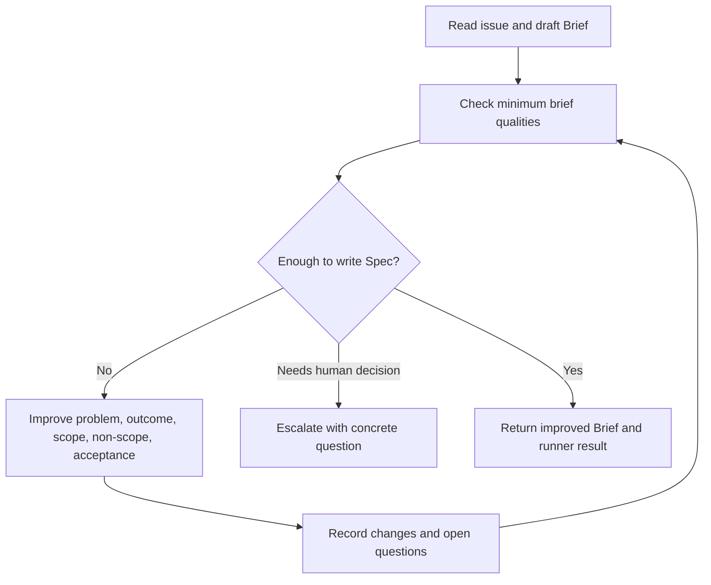

# Process Spec: Brief Improve Loop

## Goal

Turn a rough `Brief` into a workable brief that is clear enough to support a downstream `Spec`.

## Entry Criteria

- A source issue or task exists.
- A draft brief exists or can be created from the issue.
- The brief target path is writable.
- The runner state directory is writable.
- The runner has access to this process spec and `prompts/brief-improve.md`.

## Flow

## Step Contract

| Step | Runner action | Runner must update or return |
| --- | --- | --- |
| `read` | Read issue and current brief. | Input paths and brief status. |
| `assess` | Check whether problem, outcome, scope, non-scope, and acceptance are explicit. | Findings list. |
| `improve` | Rewrite the brief in English without inventing hidden business context. | Improved brief file. |
| `record` | Record checks, changes, and unresolved questions. | Runner result file and state update. |

## Exit Criteria

- The brief states the problem and desired outcome.
- Scope and non-scope are explicit.
- At least one acceptance signal exists.
- Open questions are explicit rather than hidden in vague prose.
- The runner returns `done`, `blocked`, or `escalation`.

## Escalation Rules

Stop with `escalation` when:

- the task goal is unclear;
- the brief requires a product decision that is not present in the issue;
- acceptance cannot be stated without human input;
- the requested action conflicts with repository governance.

## Runner Contract

The runner reads:

- process spec path;
- prompt path;
- target brief path;
- optional issue/source path;
- state directory.

The runner returns:

- improved brief path;
- status: `done`, `blocked`, or `escalation`;
- checks performed;
- changed artifacts;
- next action.
