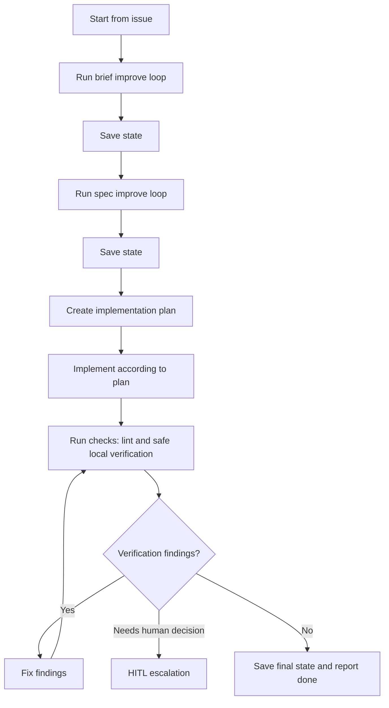
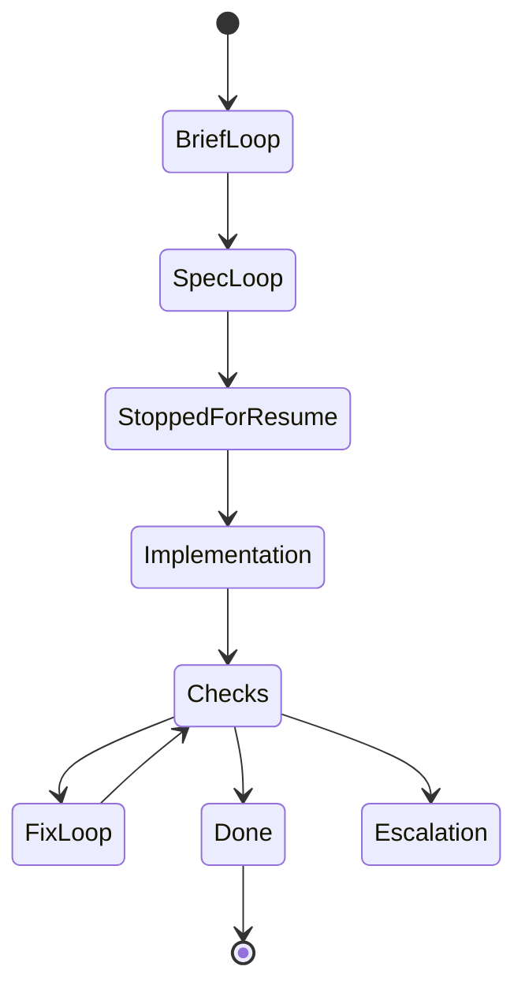

# Process Spec: Large Feature Execution Loop With State

## Goal

Drive one task through the local SDLC with saved process state, reusing the small `Brief` and `Spec` improvement loops before implementation and verification.

## Entry Criteria

- A source issue exists.
- `brief-improve-loop` and `spec-improve-loop` process specs exist.
- Runner prompt files for both small loops exist.
- `runners/improve-loop-runner.sh` exists.
- A writable state-pack exists.

## Flow

## State Diagram

## Stage Contract

| Stage | Runner or actor | Required state update |
| --- | --- | --- |
| `brief-loop` | `runners/improve-loop-runner.sh` plus brief prompt/subagent | `state/active-context.md`, `state/stage-state.md`, runner result |
| `spec-loop` | `runners/improve-loop-runner.sh` plus spec prompt/subagent | `state/active-context.md`, `state/stage-state.md`, runner result |
| `stop-resume` | parent runner | `state/session-handoff.md`, trace |
| `implementation` | parent runner | `work-item/implementation-plan.md`, `work-item/implementation-output.md`, state |
| `checks` | shell verification | `work-item/verification.md`, state |
| `safe-contour` | local reproducible check contour | `work-item/verification.md`, trace |
| `fix-loop` | parent runner | `work-item/implementation-output.md`, `work-item/verification.md`, state |
| `done` | parent runner | `trace/run-trace.md`, `report.md` |

## Exit Criteria

- Brief and Spec small loops have `done` runner results.
- Implementation plan exists and has been followed.
- Safe local checks have passed.
- Verification findings are either fixed or escalated.
- State-pack records the current status and final decision.
- Trace/report show the final status.

## Escalation Rules

Escalate when:

- the issue requires product scope not present in the brief;
- the spec needs a real architecture decision;
- verification requires unavailable secrets, `.env*`, production data, or a real stage not present in the repository;
- a destructive or externally effective action would be needed.

## Safe Deployment / Stage Equivalent

This repository does not require a real deploy for a documentation-only homework artifact. The safe contour for this run is:

- repository diff validation with `rtk git diff --check`;
- Biome lint through `rtk npm run lint` from `tools/agentscope`;
- file-presence smoke checks for the required HW-4 full artifacts.

## Runner Contract

The large-loop runner must record:

- stage entered;
- runner used;
- artifacts changed;
- state files updated;
- checks performed;
- stop/resume event, if any;
- final status: `done`, `blocked`, or `escalation`.
