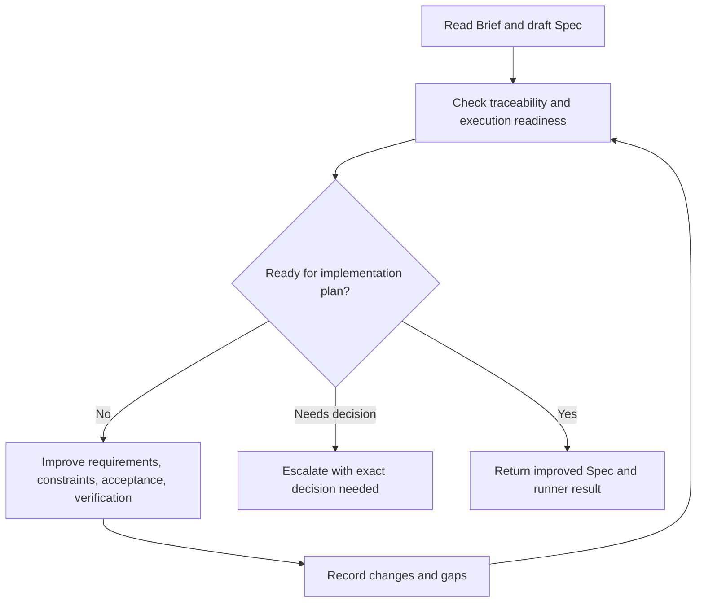

# Process Spec: Spec Improve Loop

## Goal

Turn a draft `Spec` package into a workable execution input that can support an implementation plan and verification loop.

## Entry Criteria

- An improved `Brief` exists.
- A draft `Spec` exists.
- The spec target path is writable.
- The runner state directory is writable.
- The runner has access to this process spec and `prompts/spec-improve.md`.

## Flow

## Step Contract

| Step | Runner action | Runner must update or return |
| --- | --- | --- |
| `read` | Read improved brief and current spec. | Input paths and spec status. |
| `assess` | Check requirements, non-scope, constraints, acceptance, and verification. | Findings list. |
| `improve` | Rewrite the spec so a plan can be derived from it. | Improved spec file. |
| `record` | Record checks, changes, and unresolved questions. | Runner result file and state update. |

## Exit Criteria

- Requirements and non-scope are explicit.
- Acceptance scenarios are testable.
- Verification commands or manual procedures are named.
- Constraints and risks are explicit enough for a plan.
- The runner returns `done`, `blocked`, or `escalation`.

## Escalation Rules

Stop with `escalation` when:

- the spec contradicts the brief;
- an architecture decision is required before planning;
- verification cannot be defined without unavailable external context;
- implementation would require changing production scope outside the homework.

## Runner Contract

The runner reads:

- process spec path;
- prompt path;
- target spec path;
- improved brief path;
- state directory.

The runner returns:

- improved spec path;
- status: `done`, `blocked`, or `escalation`;
- checks performed;
- changed artifacts;
- next action.
