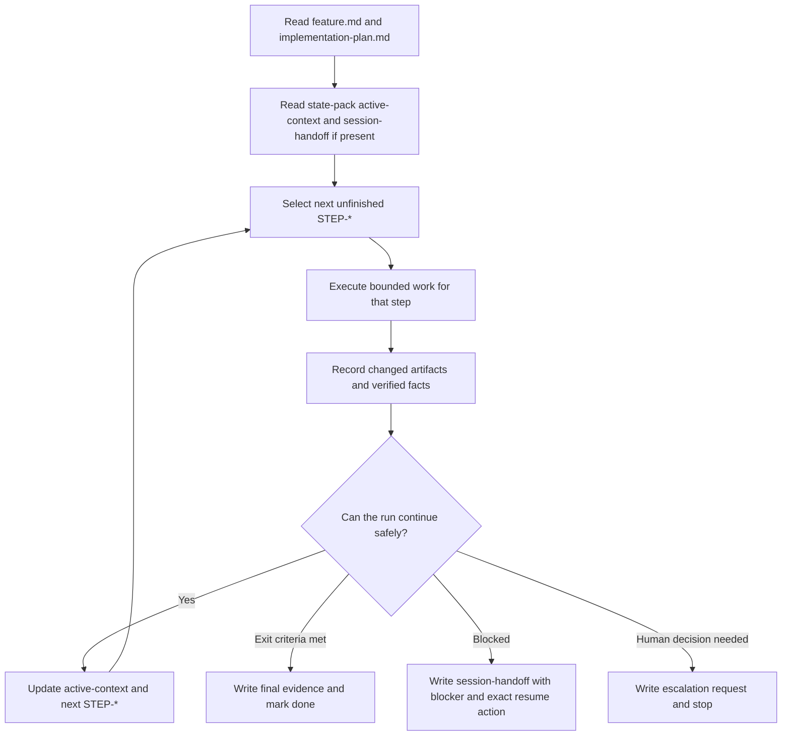
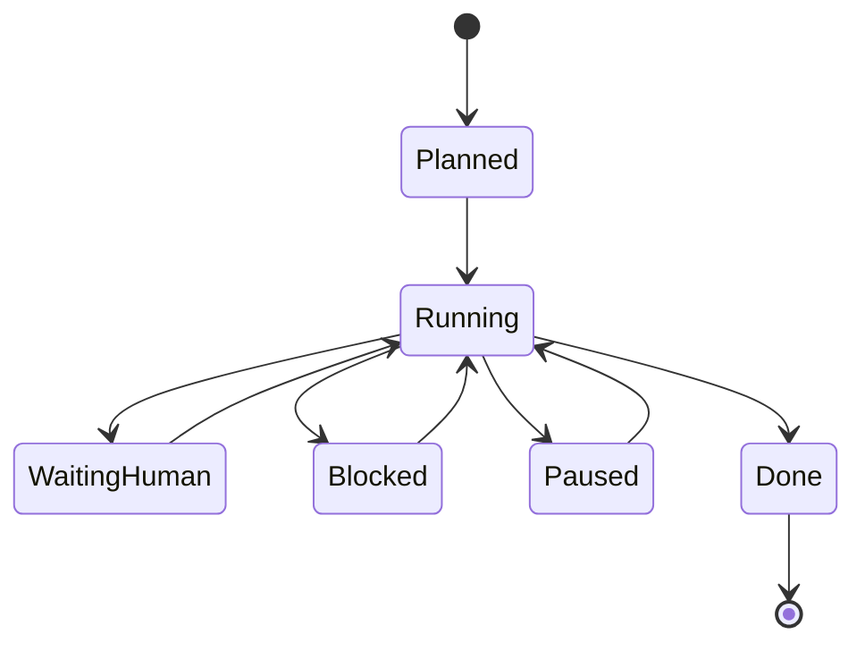

# Process Spec: Memory-Bank Long-Run Feature Execution

## Goal

Move one governed memory-bank feature execution from the next planned step to a verified handoff point without losing context between agent sessions.

This process is intentionally small: it does not replace the full feature flow. It runs one bounded execution slice, records evidence, and either continues, finishes, blocks, or escalates.

## Entry Criteria

- A memory-bank feature package exists.
- `feature.md` is the canonical scope owner and is mature enough to execute from.
- `implementation-plan.md` exists and contains at least one unfinished `STEP-*`.
- The agent has read `memory-bank/flows/agent-process-operations.md`.
- The run has a writable state-pack directory with `active-context.md`.

## Flow

## States

## Step Contract

| Step | Agent action | Required artifact update |
| --- | --- | --- |
| `load-context` | Read canonical feature scope, execution plan, and any current state files. | Add the active `STEP-*`, assumptions, and known risks to `active-context.md`. |
| `execute-step` | Perform only the bounded work needed for the selected `STEP-*`. | Record touched files and changed behavior in `active-context.md`. |
| `verify-step` | Run the smallest meaningful verification for the changed surface. | Record command, result, and remaining gaps in `active-context.md`. |
| `decide-next` | Choose `continue`, `done`, `blocked`, or `escalation`. | Update `active-context.md`; write or rewrite `session-handoff.md` if the run stops. |
| `resume` | Reconcile `session-handoff.md` with `implementation-plan.md` and continue from the first safe action. | Append the resume event to `traces/stop-resume-trace.md` and update `active-context.md`. |

## Escalation Rules

Stop and ask a human when:

- the next step would change canonical scope, acceptance criteria, or architecture;
- a blocker cannot be resolved from local repo context;
- verification needs credentials, production data, or external state that is not available locally;
- the action is destructive, externally effective, or difficult to reverse;
- review findings disagree about the correct product or engineering decision.

## Exit Criteria

The loop can stop with `done` only when:

- the selected `STEP-*` has been completed or explicitly deferred with a reason;
- the verification result is recorded;
- changed artifacts are listed;
- the next step is clear, or no next step remains;
- no stale `session-handoff.md` points to obsolete work.

## Observable Runner Contract

The runner must read:

- this process spec;
- `runner-prompt.md`;
- `state-pack/active-context.md`;
- `state-pack/session-handoff.md`, if present;
- the relevant memory-bank feature package or homework substitute artifacts.

After one iteration, the runner must write:

- the current step status;
- changed artifact list;
- verification facts;
- next action or stop reason;
- exactly one process status: `continue`, `done`, `blocked`, or `escalation`.

## Runner Status Values

- `continue`: the current step moved forward and another bounded step can safely start.
- `done`: the process exit criteria are satisfied.
- `blocked`: execution cannot continue without a missing artifact, tool, environment, or fact.
- `escalation`: a human decision is needed before the next action.

## Safe Handoff / Resume Behavior

When stopping before `done`, the agent must write `state-pack/session-handoff.md` with:

- current state;
- changed artifacts;
- verified facts;
- open risks;
- stop reason;
- exact next action;
- escalation status.

On resume, the next agent must read `session-handoff.md` before editing anything, confirm the recorded next action still matches the plan, and append a resume event to `traces/stop-resume-trace.md`.
