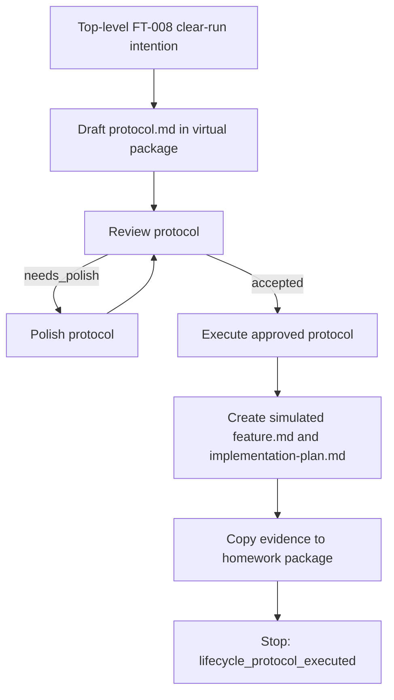

# Protocol: `FT-008 Clear Read-Only Lifecycle Rerun`

## Source Interpretation

Source used:

- `homeworks/hw-5/task-1-clear-run/initial-prompt.md`
- Existing implemented FT-008 package copied into this workflow worktree from the primary repository.

English interpretation:

- The run starts from a top-level feature/problem intention, not from an already drafted feature document.
- The run must create and review this `protocol.md` before any downstream feature-development documents are created or simulated.
- The run is read-only with respect to implementation: it must not edit `tools/agentscope` or reimplement FT-008.
- Downstream feature-development artifacts may be created only in this isolated workflow worktree, and only after the approved protocol permits them.

Repository adaptation:

- External or legacy phase names such as `Brief` and `Spec Pack` map to this repository's governed owners: `feature.md` and `implementation-plan.md`.
- No new legacy `brief.md`, `spec.md`, or `plan.md` artifacts are permitted.
- The virtual package `memory-bank/features/FT-008-clear-run/` is a simulation area for this proof run, not a new primary-repo feature package.
- Existing `memory-bank/features/FT-008/` is baseline evidence of the implemented feature, not evidence that the original implementation followed protocol-first ordering.

## Metadata

- Protocol version: 0.1
- Owner: Igor Arkhipov
- Work area: `/Users/igor.arkhipov/Documents/Work/Ruby/thinknetica/ai-setup`
- Workflow run: `2026-05-17-1730-ft-008-clear-readonly`
- Workflow worktree: `.worktrees/2026-05-17-1730-ft-008-clear-readonly`
- Created: 2026-05-17
- Last updated: 2026-05-17
- Status: active
- Current phase: done
- Current gate: H1

## Goal

Prove corrected lifecycle ordering for Homework 5 Task 1: start from a top-level FT-008 intention, create a protocol first, review and groom it, then execute it in read-only/simulated mode so downstream feature documents appear only after the protocol permits them.

Target state:

- The workflow runner stops with `stop_reason: lifecycle_protocol_executed`.
- The homework evidence package records run id, worktree, state dir, stage sequence, transition statuses, and file evidence.
- `protocol.md` is the first lifecycle artifact in the virtual package.
- Any downstream documents are copied under `simulated-feature-docs/` as evidence and are clearly marked simulated.
- `tools/agentscope` remains untouched by this run.

## Scope

In scope:

- Create, review, and, if needed, polish this protocol in the generated workflow worktree.
- Execute the approved protocol in read-only/simulated mode.
- Create simulated downstream docs only under `memory-bank/features/FT-008-clear-run/` in the generated workflow worktree.
- Copy final evidence into `homeworks/hw-5/task-1-clear-run/` in the primary repo.
- Record the explicit doc sync from the primary repo into the generated worktree.

Out of scope:

- Editing `tools/agentscope`.
- Reimplementing FT-008.
- Creating a new primary-repo feature package outside the homework evidence copy.
- Reading or using `.env*` files.
- Committing, pushing, merging, releasing, publishing, or mutating external systems.
- Claiming that the original FT-008 implementation happened protocol-first.

## Current Facts / Baseline

Verified facts:

- The runner created this workflow with current stage `draft-lifecycle-protocol`; evidence: `tmp/agent-workflows/2026-05-17-1730-ft-008-clear-readonly/run.json`.
- The primary repo contains implemented FT-008 documents; evidence: `memory-bank/features/FT-008/README.md`, `feature.md`, and `implementation-plan.md`.
- The workflow worktree was created from `HEAD`, so current lifecycle docs were explicitly synced from the primary repo into the workflow worktree before stage fulfillment; evidence: operator command recorded in homework execution summary.
- The initial prompt forbids `tools/agentscope` edits and allows only read-only or simulated downstream docs; evidence: `homeworks/hw-5/task-1-clear-run/initial-prompt.md`.
- The lifecycle workflow stages are `draft-lifecycle-protocol`, `review-lifecycle-protocol`, `polish-lifecycle-protocol`, and `execute-lifecycle-protocol`; evidence: `.ai-setup/workflows/lifecycle-feature.json`.

Unchecked hypotheses:

- The review stage may find polish issues in this draft protocol.
- The runner transition for protocol execution will stop with `lifecycle_protocol_executed` once the execute stage returns `Status: done`.

## Operating Constraints

- Do not read or use `.env*` files.
- Treat active `memory-bank/` documents as authoritative.
- Prefix shell commands with `rtk`.
- Use the generated workflow worktree for virtual lifecycle artifacts.
- Use the primary repo only for the homework evidence package.
- Keep implementation code read-only.
- Keep verification separate from acceptance and cleanup.

## Roles

| Actor | Role | Allowed actions | Must not do |
| --- | --- | --- | --- |
| Human owner | task owner | authorize scope, inspect evidence, request cleanup | treat simulated docs as implementation evidence |
| Workflow operator | stage executor | prepare stages, write permitted artifacts, transition runner state, copy evidence | skip runner transitions or edit unrelated files |
| Protocol reviewer | review owner | review `protocol.md` against lifecycle criteria | create downstream docs during review |
| Protocol polisher | repair owner | edit only `protocol.md` and result notes when review requires polish | change implementation code |
| Protocol executor | simulated lifecycle executor | create permitted virtual downstream docs after protocol approval | edit `tools/agentscope` or primary feature package |

## Permissions

| Tool / action | Risk | Default policy | Notes |
| --- | --- | --- | --- |
| Read repository docs and workflow state | low | allow | except `.env*` |
| Sync lifecycle docs into generated worktree | low | already allowed | `.env*` excluded |
| Edit this protocol in generated worktree | low | allow at H0 | protocol draft/review/polish only |
| Create simulated downstream docs in generated worktree | low | allow after H1 | only after review accepts this protocol |
| Copy evidence into homework folder | low | allow after execution | primary repo writes stay under homework path |
| Edit `tools/agentscope` | medium | forbidden | this is a read-only rerun |
| Commit, push, merge, release, publish | high | H2 required | not part of this run |
| Destructive or irreversible action | critical | H3 required | not part of this run |

## State

- Status: done
- Current phase: done
- Current gate: H1
- Current actor: Workflow operator
- Next action: copy final protocol, stage results, manifest, and simulated docs into the homework evidence package.
- Open loops:
  - Primary homework evidence package still needs final assembly and verification.
- Rollback mode: remove the generated worktree artifacts and homework evidence files for this run; no implementation state is changed.

## Human Gates

### H1: Approve scoped execution

Required before:

- Creating simulated downstream docs under `memory-bank/features/FT-008-clear-run/`.
- Copying simulated downstream docs into the primary homework evidence package.

Approval record:

- Approver: Igor Arkhipov
- Date: 2026-05-17
- Scope approved: This prompt explicitly requests a read-only lifecycle rerun and simulated downstream docs after protocol approval.
- Conditions: Do not edit `tools/agentscope`; do not read `.env*`; keep primary writes under `homeworks/hw-5/task-1-clear-run/`.

### H2: Commit point / production go-no-go

Required before:

- Creating a git commit.
- Pushing, opening a PR, merging, releasing, or publishing.
- Mutating any real provider configuration.

Required evidence before H2:

- Complete homework evidence package.
- Final workflow manifest with `stop_reason: lifecycle_protocol_executed`.
- Verification commands recorded in `execution-summary.md`.

Approval record:

- Approver:
- Date:
- Scope approved:
- Conditions:

### H3: Destructive or irreversible action

Required before:

- Deleting user data or non-test backups.
- Removing unrelated worktrees or branches.
- Running irreversible filesystem or external actions.

Approval record:

- Approver:
- Date:
- Exact action approved:
- Rollback expectation:

## Hard Stop Conditions

Stop immediately and update `State` to `blocked` or `waiting_human` if:

- any step requires reading, printing, copying, or deriving values from `.env*`;
- any step would edit `tools/agentscope`;
- any step would create a non-homework primary-repo feature package for `FT-008-clear-run`;
- any generated diff includes unrelated resources;
- rollback path is missing before a high-risk action;
- approval scope is unclear;
- review finds unresolved protocol issues and execution is not explicitly bounded to repair;
- the workflow runner reports malformed state or an unexpected current stage.

## Entry Criteria

The protocol may move from review to execution only when:

- `review-lifecycle-protocol` has returned `Status: accepted` and `Open findings: 0`;
- any required `polish-lifecycle-protocol` stage has completed and re-review accepted the result;
- the virtual package contains this `protocol.md`;
- the virtual package does not yet contain simulated downstream `README.md`, `feature.md`, or `implementation-plan.md`;
- H1 scope remains limited to read-only/simulated lifecycle evidence;
- `tools/agentscope` remains read-only for this run.

## Execution Plan

### Phase 0: Protocol Intake And Baseline

- Agent does: read initial prompt, workflow manifest, lifecycle workflow/stage definitions, active flow docs, and existing FT-008 package.
- Reads: `initial-prompt.md`, `run.json`, `.ai-setup/workflows/lifecycle-feature.json`, lifecycle stage configs, `memory-bank/flows/`, `memory-bank/features/FT-008/`.
- May update: this `protocol.md` only.
- Evidence: protocol source interpretation and current facts.
- Continue when: draft protocol exists.
- Stop when: minimum inputs are missing or baseline cannot be stated honestly.

### Phase 1: Protocol Review And Grooming

- Agent does: review `protocol.md` against lifecycle review criteria.
- Reads: this `protocol.md`, active lifecycle templates, review prompt, workflow manifest.
- May update: review result file; if needed, this `protocol.md` during polish.
- Evidence: `stage-results/review-lifecycle-protocol.md` and optional `stage-results/polish-lifecycle-protocol.md`.
- Continue when: review returns accepted with zero open findings.
- Stop when: review returns unresolved `needs_upstream`, `blocked`, `needs_human`, or `failed`.

### Phase 2: Read-Only Protocol Execution

- Agent does: execute exactly the approved read-only simulation step.
- Reads: accepted `protocol.md`, existing FT-008 package, workflow manifest.
- May update: `memory-bank/features/FT-008-clear-run/README.md`, `feature.md`, and `implementation-plan.md` in the generated worktree only; execution stage result.
- Evidence: a before/after file-presence check showing `README.md`, `feature.md`, and `implementation-plan.md` were absent before protocol acceptance and present only after execution; simulated docs copied into homework package; execution result.
- Continue when: simulated downstream docs exist and are clearly marked as simulation.
- Stop when: any step would edit implementation code or primary non-homework docs.

### Phase 3: Homework Evidence Assembly

- Agent does: copy final protocol, review/polish results, workflow manifest, stage results, and simulated docs into the homework package.
- Reads: workflow state dir and generated worktree artifacts.
- May update: `homeworks/hw-5/task-1-clear-run/**` in the primary repo.
- Evidence: `execution-summary.md`, `workflow-run.json`, `evidence/package-tree.txt`.
- Continue when: verification checks pass.
- Stop when: evidence is incomplete or runner stop reason differs from `lifecycle_protocol_executed`.

## Exit Criteria

The protocol execution is done only when:

- the runner stage history shows draft, review, any required polish, re-review, and execute stages in that order;
- `workflow-run.json` records `stop_reason: lifecycle_protocol_executed`;
- the final `protocol.md` is copied into the homework evidence package;
- `protocol-review.md` and, when used, `protocol-polish.md` are copied or summarized in the homework evidence package;
- simulated downstream docs are copied under `homeworks/hw-5/task-1-clear-run/simulated-feature-docs/`;
- `execution-summary.md` records the run id, worktree, state dir, sync operation, stage sequence, transition statuses, and ordering proof;
- verification checks have current output recorded;
- no implementation files under `tools/agentscope` were edited by this run.

## Verification

Required checks:

- [ ] `rtk ./.ai-setup/scripts/test-agent-workflow.sh`
- [ ] `rtk git diff --check -- homeworks/hw-5/task-1-clear-run`
- [ ] File-presence check for required homework package files and directories.

Acceptance evidence:

- `homeworks/hw-5/task-1-clear-run/execution-summary.md`
- `homeworks/hw-5/task-1-clear-run/workflow-run.json`
- `homeworks/hw-5/task-1-clear-run/evidence/package-tree.txt`

## Rollback

Rollback before H2:

- Remove `homeworks/hw-5/task-1-clear-run/` if the evidence run must be discarded.
- Remove `.worktrees/2026-05-17-1730-ft-008-clear-readonly` with `git worktree remove` after inspection.
- Remove `tmp/agent-workflows/2026-05-17-1730-ft-008-clear-readonly` after preserving evidence.

Rollback after H2:

- Not applicable in this run; H2 actions are out of scope.

No-rollback / H3 zone:

- No H3 action is permitted in this run.

## What To Update During Execution

After every substantial step, update:

- `State`: current phase, gate, actor, and next action;
- `Evidence Log`: verified facts, commands, and links to artifacts;
- `Open Questions`: blockers that affect the next gate;
- `Decisions`: human decisions or selected trade-offs;
- `Rollback`: when risk or actual state changes.

## Evidence Log

| Time | Actor | Fact / action | Evidence |
| --- | --- | --- | --- |
| 2026-05-17 17:30 | Workflow operator | Started lifecycle workflow from top-level intention | `tmp/agent-workflows/2026-05-17-1730-ft-008-clear-readonly/run.json` |
| 2026-05-17 17:30 | Workflow operator | Synced current lifecycle docs into generated worktree, excluding `.env*` | Recorded in homework execution summary |
| 2026-05-17 17:30 | Workflow operator | Created protocol before downstream simulated docs | this file |
| 2026-05-17 17:30 | Protocol polisher | Added explicit entry/exit criteria and downstream-doc absence evidence requirement | `stage-results/polish-lifecycle-protocol.md` |
| 2026-05-17 17:30 | Protocol executor | Confirmed downstream docs were absent before execution, then created simulated README, feature, and implementation-plan docs | `stage-results/execute-lifecycle-protocol.md` |

## Decisions

| Date | Decision | Owner | Reason |
| --- | --- | --- | --- |
| 2026-05-17 | Use `memory-bank/features/FT-008-clear-run/` as a virtual worktree-only package | Workflow operator | Satisfies stage artifact contracts without adding a primary-repo feature package |
| 2026-05-17 | Treat existing FT-008 implementation as baseline only | Workflow operator | Prevents false proof that original implementation was protocol-first |

## Open Questions

- none

## Observable Runner Contract

The protocol execution stage must return exactly one process status:

- `continue`
- `done`
- `blocked`
- `escalation`

For this read-only proof run, `done` means:

- review accepted the protocol;
- simulated downstream docs were created only after that acceptance;
- implementation code was not edited;
- homework evidence was prepared or is ready to be copied;
- the runner can stop with `stop_reason: lifecycle_protocol_executed`.

## Copy-Ready Runner Prompt

Execute `memory-bank/features/FT-008-clear-run/protocol.md` in read-only/simulated mode. Do not edit `tools/agentscope`. Create only the downstream virtual feature docs permitted by Phase 2, then write an execution result showing `Status: done`, the target protocol path, zero open findings, and evidence that downstream docs were created after protocol review acceptance.

## Next Action

Actor: Protocol reviewer

Action: Copy final evidence into `homeworks/hw-5/task-1-clear-run/` and run verification.

Stop if: runner stop reason is not `lifecycle_protocol_executed` or verification fails.
