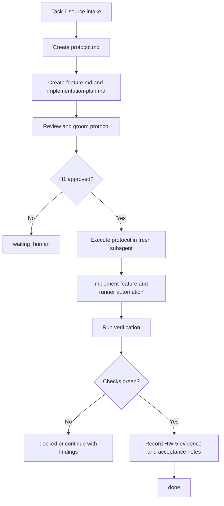

# Protocol: `FT-008 Local MCP Control Plane`

## Source Interpretation

Source used:

- User instruction in this Codex thread on 2026-05-17.
- Backlog source: `tmp/Agentscope Implementation Plan.md`, Phase 3 Tasks 19-23.

- Create a lifecycle `protocol.md` and a standard memory-bank feature document pack for one real feature.
- Groom the protocol as an artifact before execution.
- Execute the approved protocol in a fresh agent context, allowing that executor to orchestrate lower-level loops as needed.
- Record what went wrong, what should improve, and update runner automation so an initial feature intention can flow through protocol creation, review, and execution.

Repository adaptation:

- External `Brief` / `Spec Pack` wording maps to this repository's `feature.md` and `implementation-plan.md`.
- No new legacy `brief.md`, `spec.md`, or `plan.md` package artifacts are created.
- The lifecycle protocol lives in the feature package because it governs a concrete feature run and must be resumable from disk.

## Metadata

- Protocol version: 0.1
- Owner: Igor Arkhipov
- Work area: `/Users/igor.arkhipov/Documents/Work/Ruby/thinknetica/ai-setup`, feature `FT-008`, tool `tools/agentscope`
- Created: 2026-05-17
- Last updated: 2026-05-17
- Status: active
- Current phase: done
- Current gate: H2

## Goal

Use the lifecycle protocol workflow to deliver a real AgentScope feature: a local stdio MCP control plane for AgentScope discovery, plan/apply toggles, backups, restore, and doctor output.

Target state:

- `memory-bank/features/FT-008/` contains a groomed `protocol.md`, canonical `feature.md`, derived `implementation-plan.md`, and feature README.
- `tools/agentscope` exposes `agentscope mcp` with the stable MCP tool surface from Tasks 19-23.
- `homeworks/hw-5/task-1/` records the lifecycle-protocol exercise, runner automation changes, execution evidence, and improvement notes.
- Runner automation can carry an initial feature intention through protocol creation, review/grooming, and execution stages.

## Scope

In scope:

- Create and maintain the FT-008 memory-bank feature package.
- Execute the FT-008 implementation plan in `tools/agentscope`.
- Add tests and docs for `agentscope mcp`.
- Add or adjust `.ai-setup` workflow-runner support for lifecycle protocol creation, review, polish, and execution.
- Record HW-5 Task 1 evidence under `homeworks/hw-5/task-1/`.

Out of scope:

- HW-5 Task 2 operational-protocol work.
- Automatic MCP self-installation into Claude, Codex, Cursor, or provider config files.
- Remote or HTTP MCP transport.
- Plugin/tool install or uninstall lifecycle work.
- Reading or using `.env*` files.
- Pushing, merging, or releasing without a separate H2 approval.

## Current Facts / Baseline

Verified facts:

- HW-5 Task 1 requires protocol creation, grooming, execution in a new session, improvement notes, and optional launcher automation; evidence: fetched assignment page on 2026-05-17.
- `memory-bank/flows/templates/protocol/lifecycle-protocol.md` exists and is active; evidence: local file read.
- `.prompts/memory-bank-create-lifecycle-protocol.md`, `.prompts/memory-bank-review-lifecycle-protocol.md`, and `.prompts/memory-bank-execute-lifecycle-protocol.md` exist; evidence: local file read.
- Current feature registry contains `FT-001` through `FT-007`; evidence: `memory-bank/features/README.md`.
- `tools/agentscope` already contains snapshots, restore, mutation vault, and provider toggle code, but no `src/mcp/` directory or `agentscope mcp` command; evidence: local file search on 2026-05-17.
- `tmp/Agentscope Implementation Plan.md` records Phase 3 Tasks 19-23 as the local MCP control plane backlog; evidence: local file read.

Unchecked hypotheses:

- The latest official MCP TypeScript SDK version will compile cleanly with this repo's TypeScript 6.0.2 setup.
- Existing mutation core exports are sufficient for MCP without large refactors.
- Fixture-backed tests can validate the MCP stdio server without requiring live Claude, Codex, or Cursor clients.

## Operating Constraints

- Do not read or use `.env*` files.
- Use active `memory-bank/` documents as authoritative for intent, flow, and feature package shape.
- Keep production code under `tools/agentscope/src/` and tests under `tools/agentscope/test/`.
- Do not hand-edit `dist/`; regenerate with `npm run build`.
- Prefer fixture-backed tests and avoid real home-directory provider config.
- Add dependencies only when required; MCP server implementation may add the official MCP SDK.
- Keep verification separate from acceptance and release.

## Roles

| Actor | Role | Allowed actions | Must not do |
| --- | --- | --- | --- |
| Human owner | decision maker | approve H1/H2/H3 gates, accept scope, request changes, stop execution | give implicit approval for destructive or external actions |
| Master Codex agent | lifecycle coordinator | create and groom protocol/docs, route execution, verify evidence, update protocol state | pretend chat memory is state or skip artifact verification |
| Protocol execution subagent | feature implementer | read `protocol.md`, execute allowed steps, edit scoped source/docs/tests, run local checks | cross gates, redefine scope, read `.env*`, mutate unrelated files |
| Review agent | protocol or code reviewer | inspect artifacts, return findings, recommend fixes | change implementation while acting as reviewer |
| Local verifier | verification owner | run build/test/lint commands and record evidence | claim completion without current command output |

## Permissions

| Tool / action | Risk | Default policy | Notes |
| --- | --- | --- | --- |
| read repository files | low | allow | except `.env*` |
| fetch HW-5 assignment page | low | allow | basic-auth source already used for Task 1 interpretation |
| edit `memory-bank/features/FT-008/` | low | allow after H1 | scoped governed docs |
| edit `tools/agentscope/src/`, `tools/agentscope/test/`, README, package files | medium | allow after H1 | source changes for this feature |
| edit `.ai-setup` lifecycle workflow runner files | medium | allow after H1 | runner automation requested by user |
| write `homeworks/hw-5/task-1/` evidence | low | allow after H1 | homework evidence |
| install npm dependency under `tools/agentscope` | medium | allow after H1 | only for required MCP SDK/support deps |
| commit, push, merge, release, publish package, or mutate live provider configs | high | H2 required | not approved by this protocol |
| destructive or irreversible actions | critical | H3 required | separate explicit approval only |

## State

- Status: done
- Current phase: done
- Current gate: H2
- Current actor: none
- Next action: no further protocol execution; commit, push, PR, or CI follow-up requires explicit H2 approval.
- Open loops:
  - H2 commit/push/CI follow-up is not approved or requested.
- Rollback mode: source-only revert for repository edits; no live provider or external state mutation is allowed.

## Human Gates

### H1: Approve scoped execution

Required before:

- Editing `tools/agentscope`, `.ai-setup`, `memory-bank/features/FT-008`, or `homeworks/hw-5/task-1`.
- Installing MCP-related npm dependencies under `tools/agentscope`.
- Spawning an execution subagent to implement the feature.

Approval record:

- Approver: Igor Arkhipov
- Date: 2026-05-17
- Scope approved: HW-5 Task 1 lifecycle protocol exercise, FT-008 feature package, AgentScope local MCP control plane implementation, runner automation, and homework evidence.
- Conditions: Do not read `.env*`; focus Task 1 only; use the next AgentScope backlog item; keep evidence under `homeworks/hw-5`; update runner automation.

### H2: Commit point / production go-no-go

Required before:

- Creating a git commit.
- Pushing, opening a PR, merging, or publishing.
- Applying AgentScope mutations to real user provider config outside tests.

Required evidence before H2:

- `cd tools/agentscope && npm run build`
- `cd tools/agentscope && npm test`
- `cd tools/agentscope && npm run lint`
- `.ai-setup/scripts/test-agent-workflow.sh`
- HW-5 evidence package updated.

Approval record:

- Approver:
- Date:
- Scope approved:
- Conditions:

### H3: Destructive or irreversible action

Required before:

- Deleting user data, real provider configs, or non-test backups.
- Running package publication or release actions.
- Any irreversible filesystem or external system mutation.

Approval record:

- Approver:
- Date:
- Exact action approved:
- Rollback expectation:

## Hard Stop Conditions

Stop immediately and update `State` to `blocked` or `waiting_human` if:

- any step requires reading, printing, copying, or deriving values from `.env*`;
- any command would mutate real provider config outside fixture or temp test roots;
- implementation requires automatic MCP self-installation into a provider config;
- a dependency install requires credentials or secrets;
- rendered diff includes unrelated resources;
- rollback path is missing before a high-risk action;
- approval scope is unclear;
- verification cannot be run and there is no acceptable manual-only gap recorded;
- protocol execution would redefine scope, architecture, or acceptance criteria owned by `feature.md`.

## Lifecycle Flow



## Execution Plan

### Phase 0: No-Mutation Audit

- [x] Confirm clean or understood worktree.
- [x] Fetch and interpret HW-5 Task 1 source.
- [x] Read active memory-bank flow and protocol docs.
- [x] Confirm the next feature slice from current code and backlog.
- [x] Record evidence in `Evidence Log`.

Exit criteria:

- baseline facts are recorded;
- unknowns are resolved or moved to `Open Questions`;
- no source mutation happened before H1 scope was understood.

### Phase 1: Governed Intent / Design

- [x] Create `memory-bank/features/FT-008/README.md`.
- [x] Create active canonical `feature.md`.
- [x] Create active derived `implementation-plan.md`.
- [x] Create this lifecycle `protocol.md`.
- [x] Groom protocol through a review pass and update findings.
- [x] Update `memory-bank/features/README.md`.
- [x] Record evidence in `Evidence Log`.

Exit criteria:

- governed feature artifacts are present and linked;
- review findings are fixed or explicitly deferred;
- no risky mutation has happened.

### Phase 2: Implementation Planning

- [x] Ground implementation plan in current `tools/agentscope` modules and tests.
- [x] Identify approval gates, stop conditions, and verification commands.
- [x] Record feature implementation sequence through `STEP-*`.

Exit criteria:

- implementation plan is executable;
- risky actions remain gated;
- rollback remains source-only revert.

### Phase 3: Source Changes

- [x] Spawn a fresh worker to execute this protocol from disk.
- [x] Implement `agentscope mcp` and tests according to `implementation-plan.md`.
- [x] Add lifecycle protocol workflow runner automation.
- [x] Update README and HW-5 evidence artifacts.
- [x] Record changed artifacts and checks in `Evidence Log`.

Exit criteria:

- code and docs for FT-008 are present;
- runner automation can route lifecycle protocol create/review/execute stages;
- local tests for changed surfaces pass or failures are recorded.

### Phase 4: Verification

- [x] Run `cd tools/agentscope && npm run build`.
- [x] Run `cd tools/agentscope && npm test`.
- [x] Run `cd tools/agentscope && npm run lint`.
- [x] Run `.ai-setup/scripts/test-agent-workflow.sh`.
- [x] Run a source whitespace check.
- [x] Record evidence in `Evidence Log`.

Exit criteria:

- checks pass, or blockers are explicit with exact failing commands.

### Phase 5: Acceptance / Handoff

- [x] Keep `feature.md` and `implementation-plan.md` active/in progress pending human acceptance and optional CI/H2 follow-up.
- [x] Update `protocol.md` state to `waiting_human`.
- [x] Complete `homeworks/hw-5/task-1/` report and evidence map.
- [x] Stop before commit/push unless H2 is approved.

Exit criteria:

- the run can be understood from files on disk;
- final response names checks and remaining gaps.

## Phase Contract

| Phase | Required reads | May update | Must leave evidence | Allowed next statuses / phases |
| --- | --- | --- | --- | --- |
| `no_mutation_audit` | HW-5 source, `memory-bank/README.md`, flow docs, feature registry, backlog source | `protocol.md` Evidence Log only | source availability, baseline facts, selected feature goal | `protocol_review`, `blocked` |
| `protocol_review` | `protocol.md`, lifecycle review prompt, active flow docs, sibling feature docs | `protocol.md`, feature registry, `homeworks/hw-5/task-1/` review notes | review findings and fixes applied or explicitly deferred | `source_changes`, `waiting_human`, `blocked` |
| `source_changes` | `protocol.md`, `feature.md`, `implementation-plan.md`, relevant `tools/agentscope` files, `.ai-setup` runner files | scoped source, tests, README, `.ai-setup` workflow assets, protocol evidence, homework evidence | changed files, completed plan steps, local focused checks | `verification`, `continue`, `blocked`, `escalation` |
| `verification` | changed files, implementation plan checks, test output | protocol Evidence Log, implementation-plan execution summary, homework evidence | exact commands, exit status, notable warnings or failures | `acceptance_handoff`, `source_changes`, `blocked` |
| `acceptance_handoff` | protocol state, final diff summary, evidence package | `feature.md` delivery status, `implementation-plan.md` status, `protocol.md`, homework report | acceptance evidence, remaining gaps, H2 status | `done`, `waiting_human`, `blocked` |
| `done` | final state artifacts | no further mutation without new instruction | final evidence map | terminal status |

## Verification

Verification is separate from acceptance and release.

Required checks before claiming done:

- `cd tools/agentscope && npm run build`
- `cd tools/agentscope && npm test`
- `cd tools/agentscope && npm run lint`
- `.ai-setup/scripts/test-agent-workflow.sh`
- whitespace check for changed files
- file-presence check for `homeworks/hw-5/task-1/`

Manual-only checks:

- Review of client setup snippets in README; approval reference `AG-01` in `implementation-plan.md`.

## Rollback

Before H2, rollback is source-only:

- revert or edit repository files changed for FT-008;
- remove test-only temp files created under ignored `tmp/` or disposable worktree roots;
- do not touch real provider configs;
- do not publish, push, or release.

If dependency changes cause build or install failures:

- remove the dependency from `tools/agentscope/package.json`;
- regenerate `package-lock.json`;
- return protocol state to `blocked` with the failing command and error.

## What To Update During Execution

Update these artifacts after substantial work:

- `protocol.md`: `State`, `Evidence Log`, `Decisions`, `Open Questions`, and `Next Action`.
- `feature.md`: only if canonical scope, acceptance, or evidence contract changes.
- `implementation-plan.md`: step status, execution summary, and verification evidence.
- `homeworks/hw-5/task-1/`: source interpretation, protocol grooming record, execution report, runner automation notes, and package tree.

Do not update unrelated feature packages.

## Evidence Log

| Time | Phase | Evidence | Result |
| --- | --- | --- | --- |
| 2026-05-17 | source_intake | Fetched HW-5 Task 1 page with basic auth | Assignment source available and interpreted |
| 2026-05-17 | baseline | Read `memory-bank/features/README.md` | Existing registry contains `FT-001` through `FT-007` |
| 2026-05-17 | baseline | Searched `tools/agentscope/src` | No existing MCP server directory or `agentscope mcp` command found |
| 2026-05-17 | baseline | Read `tmp/Agentscope Implementation Plan.md` | Phase 3 Tasks 19-23 selected as FT-008 feature goal |
| 2026-05-17 | docs | Created `memory-bank/features/FT-008/{README.md,feature.md,implementation-plan.md,protocol.md}` | Feature pack initialized |
| 2026-05-17 | protocol_review | Independent protocol grooming pass returned four resumability findings | Fixed state consistency, single next action, phase contract, and strict runner status footer |
| 2026-05-17 | docs | Updated `memory-bank/features/README.md` | FT-008 registered in feature index |
| 2026-05-17 | runner_automation | Added `.ai-setup/workflows/lifecycle-feature.json`, lifecycle stage configs, and lifecycle transition handling | Runner can dry-run lifecycle protocol creation/review/execution path |
| 2026-05-17 | verification | Ran `./.ai-setup/scripts/test-agent-workflow.sh` | Passed: `agent-workflow assets OK` |
| 2026-05-17 | source_changes | Fresh protocol execution worker implemented MCP server under `tools/agentscope` | Added `agentscope mcp`, 9 MCP tools, tests, README docs, and dependency updates |
| 2026-05-17 | verification | Ran `cd tools/agentscope && npm run build` | Passed: `tsc -p tsconfig.json` |
| 2026-05-17 | verification | Ran `cd tools/agentscope && npx vitest run test/mcp-server.test.ts` | Passed: 1 file, 5 tests |
| 2026-05-17 | verification | Ran `cd tools/agentscope && npm test` | Passed: 23 files, 162 tests |
| 2026-05-17 | verification | Ran `cd tools/agentscope && npm run lint` | Passed: Biome checked 199 files |
| 2026-05-17 | verification | Ran built CLI stdio smoke against `dist/cli.js mcp` | Passed: listed 9 tools and found `agentscope_get_inventory_summary` |
| 2026-05-17 | verification | Ran `git diff --check` | Passed |
| 2026-05-17 | security_note | Ran `cd tools/agentscope && npm audit --audit-level=high` | Exit 0; npm reports one moderate `postcss` advisory |
| 2026-05-17 | human_review | Human review found the run did not preserve protocol-first ordering | Confirmed from session history; recorded in `homeworks/hw-5/task-1/execution-report.md` |
| 2026-05-17 | process_correction | Updated active Memory Bank flow and template docs | Future lifecycle-governed feature work must create and groom `protocol.md` before downstream feature docs |

## Decisions

- `DEC-2026-05-17-01` Select FT-008 as "Local MCP Control Plane" because Tasks 14-18 are already reflected in current code and Tasks 19-23 are the next unimplemented AgentScope feature slice.
- `DEC-2026-05-17-02` Keep the lifecycle protocol inside the feature package so a fresh worker can resume from `protocol.md` without chat memory.
- `DEC-2026-05-17-03` Include runner automation in this protocol because the user explicitly requested Task 1's optional launcher improvement.

## Open Questions

- `OQ-01` Exact MCP SDK import shape remains to be verified during `STEP-01`.
- `OQ-02` Exact self-targeted active AgentScope MCP detection is deferred to a conservative obvious-id block unless implementation finds a reliable session signal.

## Observable Runner Contract

Execution agents must return exactly one process status:

- `continue`
- `done`
- `blocked`
- `escalation`

Runner prompt:

```text
Read `memory-bank/features/FT-008/protocol.md` and execute only the current allowed lifecycle work.

Start from State, Human Gates, Hard Stop Conditions, Execution Plan, Verification, Rollback, Evidence Log, Decisions, Open Questions, and Next Action.

Use `memory-bank/features/FT-008/feature.md` for canonical scope and acceptance. Use `memory-bank/features/FT-008/implementation-plan.md` for execution sequencing.

Do not read or use `.env*` files. Do not commit, push, publish, release, or mutate real provider configs. Stop on any hard stop condition.

After substantial work, update the protocol evidence and the homework artifacts. End with:
- step worked;
- artifacts changed;
- checks performed;
- next step or stop reason.

The final line must be exactly:

PROCESS_STATUS: continue

Replace `continue` with exactly one of:
- `continue`
- `done`
- `blocked`
- `escalation`
```

## Next Action

No further protocol execution. Commit, push, PR, or CI follow-up requires explicit H2 approval.
