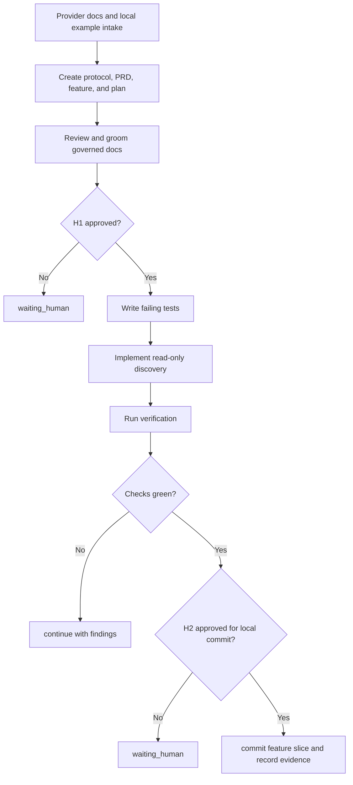

# Protocol: `FT-009 Modern Provider Surface Inventory`

## Source Interpretation

Source used:

- User instruction in this Codex thread on 2026-06-18.
- Follow-on instruction to compare Cursor, Codex, and Claude changelogs and support agent files, hooks, and plugins when possible.
- Existing memory-bank workflow rules and `tmp/Agentscope Implementation Plan.md` as initiative context.
- Official provider docs and changelogs for Cursor, Claude Code, and Codex reviewed on 2026-06-18.
- Local provider configuration shape snapshot copied into an ignored temp sandbox without reading `.env*` files.

Repository adaptation:

- External references to "brief" or "spec" map to this repository's PRD, `feature.md`, and `implementation-plan.md` model.
- This protocol lives inside `memory-bank/features/FT-009/` because the first downstream feature id is known.
- `PRD-004` owns the multi-feature initiative. `FT-009` owns the first read-only inventory slice.
- New write semantics remain out of scope until a later feature can prove provider-specific mutability and rollback behavior.

## Metadata

- Protocol version: 0.1
- Owner: Igor Arkhipov
- Work area: `/Users/igor.arkhipov/Documents/Work/Ruby/thinknetica/ai-setup`, feature `FT-009`, tool `tools/agentscope`
- Created: 2026-06-18
- Last updated: 2026-06-18
- Status: active
- Current phase: done
- Current gate: H2

## Goal

Use the memory-bank lifecycle workflow to add first-class read-only AgentScope discovery for modern provider configuration surfaces: agent files, hooks, provider settings/config files, and documented plugin manifests or enabled-plugin declarations.

Target state:

- `memory-bank/prd/PRD-004-modern-provider-configuration-surfaces.md` records the broader initiative.
- `memory-bank/features/FT-009/` contains protocol, canonical feature document, derived implementation plan, and README.
- `tools/agentscope` reports the new surfaces in normalized inventory without enabling new writes.
- CLI, MCP, snapshot schemas, README, and tests agree on the expanded taxonomy.
- The feature is committed as one local feature-slice commit after verification passes.

## Scope

In scope:

- Create and maintain the FT-009 memory-bank feature package.
- Update AgentScope's discovery taxonomy and schema validation for read-only modern surfaces.
- Discover fixture-backed Claude, Codex, and Cursor agent, hook, settings/config, plugin-manifest, and plugin-config surfaces where supported by official docs and local examples.
- Update tests and README/capability documentation.
- Use subagents for document review and implementation or review checkpoints where useful.

Out of scope:

- Mutating real provider configuration.
- Reading or using `.env*` files.
- Installing, uninstalling, enabling, or disabling plugins, hooks, settings, or agent files.
- Treating provider cache internals as writable contracts.
- Pushing, opening a PR, merging, releasing, or publishing without separate approval.

## Current Facts / Baseline

Verified facts:

- Current AgentScope item kinds are `skill`, `mcp`, and `plugin`; evidence: `tools/agentscope/src/core/models.ts`.
- Current MCP schemas mirror the older kind and category enums; evidence: `tools/agentscope/src/mcp/schemas.ts`.
- Claude Code official docs describe settings, MCP, hooks, plugins, and agents/subagents; evidence: Claude subagent research on 2026-06-18.
- Cursor official docs describe CLI config, permissions, sandbox config, MCP, hooks, plugins, agents/subagents, rules, skills, and cloud environment config; evidence: Cursor subagent research on 2026-06-18.
- Codex official docs describe `config.toml`, project `.codex/config.toml`, hooks, plugins, MCP servers, and custom agents; evidence: Codex manual review on 2026-06-18.
- Local examples show Claude, Codex, and Cursor configuration files and plugin/agent directories, copied only as shape metadata into ignored `tmp/provider-surface-sandbox/`; evidence: local shape snapshot generated on 2026-06-18.
- The worktree has an unrelated modified `homeworks/hw-5/task-2/execution-summary.md`; evidence: `git status --short --branch`.

Unchecked hypotheses:

- The existing provider modules can absorb read-only modern surface discovery without large architectural refactors.
- Snapshot schema version `1` can remain valid if new enum values are backwards-compatible and validated through the current schema layer.
- Cursor compatibility paths for `.claude/agents/` and `.codex/agents/` can be represented without confusing users through duplicate provider interpretations.

## Operating Constraints

- Do not read or use `.env*` files.
- Use active memory-bank documents as authoritative for intent, flow, and feature package shape.
- Use fixture-backed tests and temporary roots only; never mutate real provider config.
- Keep production code under `tools/agentscope/src/` and tests under `tools/agentscope/test/`.
- Do not hand-edit `dist/`; regenerate with `npm run build`.
- Keep new modern surfaces read-only unless a later feature explicitly changes mutability.
- Keep verification separate from release and external operations.

## Roles

| Actor | Role | Allowed actions | Must not do |
| --- | --- | --- | --- |
| Human owner | decision maker | approve gates, accept risk, stop execution | give implicit approval for external actions |
| Master Codex agent | lifecycle coordinator | update governed docs, orchestrate subagents, review evidence, run verification | pretend chat memory is state or skip artifact updates |
| Document reviewer subagent | protocol and document reviewer | review PRD, feature, and plan for consistency and feasibility | change implementation while reviewing docs |
| Implementer subagent | source changes | edit scoped source/docs/tests in a bounded task, follow TDD | mutate real provider configs or unrelated files |
| Code reviewer subagent | verification reviewer | review diff for correctness, scope, and test gaps | change implementation while reviewing |
| Local verifier | verification owner | run build/test/lint commands and record evidence | claim completion without current command output |

## Permissions

| Tool / action | Risk | Default policy | Notes |
| --- | --- | --- | --- |
| read repository files | low | allow | except `.env*` |
| read official provider docs | low | allow | source of truth for time-sensitive provider surfaces |
| copy provider config shapes into ignored temp sandbox | medium | allow after H1 | values must be omitted; `.env*` excluded |
| edit `memory-bank/prd/PRD-004*` and `memory-bank/features/FT-009/` | low | allow after H1 | governed docs for this initiative and feature |
| edit `tools/agentscope/src/`, `tools/agentscope/test/`, and `tools/agentscope/README.md` | medium | allow after H1 | scoped source, test, and docs |
| create a local feature-slice commit | medium | H2 required | user granted milestone continuation, but push/PR/merge are not included |
| mutate real provider config, push, open PR, merge, release, publish | high | separate approval required | not approved by this protocol |
| destructive or irreversible actions | critical | H3 required | separate explicit approval only |

## State

- Status: active
- Current phase: done
- Current gate: H2
- Current actor: none
- Next action: no further local protocol execution for FT-009; push, PR, merge, release, publication, or real provider mutation requires separate explicit approval.
- Open loops:
  - None for local FT-009 acceptance closure.
- Rollback mode: source-only revert for repository edits; no live provider or external state mutation is allowed.

## Human Gates

### H1: Approve scoped execution

Required before:

- Editing `tools/agentscope`, `memory-bank/prd`, or `memory-bank/features/FT-009`.
- Spawning implementation/review subagents.
- Copying local provider config shapes into ignored temp sandbox files.

Approval record:

- Approver: Igor Arkhipov
- Date: 2026-06-18
- Scope approved: Continue with the memory-bank workflow, use real local application configuration examples through temporary copies only, implement suggested provider-surface features when possible, and use subagents.
- Conditions: Do not modify real provider configuration directly; do not read or use `.env*`; use one commit per feature slice.

### H2: Commit point / production go-no-go

Required before:

- Creating the local FT-009 feature-slice commit.
- Pushing, opening a PR, merging, publishing, or releasing.
- Applying AgentScope mutations to real user provider config outside tests.

Required evidence before H2:

- Targeted FT-009 test output showing the new discovery coverage.
- `cd tools/agentscope && npm run build`
- `cd tools/agentscope && npm test`
- `cd tools/agentscope && npm run lint`
- `git diff --check`
- Documentation and protocol evidence updated.

Approval record:

- Approver: Igor Arkhipov
- Date: 2026-06-18
- Scope approved: Local FT-009 feature-slice commit after green verification and clean focused re-review.
- Conditions: No push, PR, merge, release, publication, or real provider configuration mutation is approved by this record.

### H3: Destructive or irreversible action

Required before:

- Deleting user data, real provider configs, or non-test backups.
- Running package publication or release actions.
- Any irreversible filesystem or external system mutation.

Approval record:

- Approver:
- Date:
- Exact action approved:
- Rollback expectation:

## Hard Stop Conditions

Stop immediately and update `State` to `blocked` or `waiting_human` if:

- any step requires reading, printing, copying, or deriving values from `.env*`;
- any command would mutate real provider config outside fixture or temp test roots;
- implementation requires undocumented write behavior for plugins, hooks, settings, or agent files;
- rendered diff includes unrelated resources;
- rollback path is missing before a high-risk action;
- approval scope is unclear;
- verification cannot be run and there is no acceptable manual-only gap recorded;
- protocol execution would redefine scope, architecture, or acceptance criteria owned by `feature.md`.

## Lifecycle Flow

## Execution Plan

### Phase 0: No-Mutation Audit

- [x] Confirm clean or understood worktree.
- [x] Review memory-bank workflow and protocol rules.
- [x] Review official Cursor, Claude Code, and Codex docs or current local manual.
- [x] Capture local provider shape snapshot without reading `.env*`.
- [x] Record evidence in `Evidence Log`.

Exit criteria:

- baseline facts are recorded;
- unknowns are resolved or moved to `Open Questions`;
- no risky mutation has happened.

### Phase 1: Governed Intent / Design

- [x] Create `PRD-004`.
- [x] Create `memory-bank/features/FT-009/README.md`.
- [x] Create active canonical `feature.md`.
- [x] Create active derived `implementation-plan.md`.
- [x] Create this lifecycle `protocol.md`.
- [x] Review/groom the governed docs through a subagent checkpoint.
- [x] Update `memory-bank/prd/README.md` and `memory-bank/features/README.md`.
- [x] Record review evidence in `Evidence Log`.

Exit criteria:

- governed feature artifacts are present and linked;
- review findings are fixed or explicitly deferred;
- no risky mutation has happened.

### Phase 2: Implementation Planning

- [x] Ground implementation plan in current `tools/agentscope` modules and tests.
- [x] Identify approval gates, stop conditions, and verification commands.
- [x] Keep the first slice read-only.
- [x] Record any plan review findings.

Exit criteria:

- implementation plan is executable;
- risky actions remain gated;
- rollback remains source-only revert.

### Phase 3: Source Changes

- [x] Write failing tests for the new taxonomy and provider inventory behavior.
- [x] Implement minimal code to pass the tests.
- [x] Update README/capability docs.
- [x] Confirm diff is limited to intended resources.
- [x] Update `Evidence Log`.

Exit criteria:

- source changes match scope;
- verification commands are recorded;
- rollback remains known.

### Phase 4: Verification, Review, And Acceptance

- [x] Run targeted and full local checks.
- [x] Run subagent code review or equivalent review checkpoint.
- [x] Resolve or explicitly accept findings.
- [x] Record verification evidence.
- [x] Record final H2 state.
- [ ] Create one local commit if H2 is approved.

Exit criteria:

- review findings are resolved or explicitly accepted;
- verification evidence is recorded;
- the human owner can accept, reject, or request another loop from current evidence.

## Verification

Required checks:

- [x] `cd tools/agentscope && npx vitest run test/provider-discovery.test.ts test/mcp-server.test.ts`
- [x] `cd tools/agentscope && npm run build`
- [x] `cd tools/agentscope && npm test`
- [x] `cd tools/agentscope && npm run lint`
- [x] `git diff --check`

Acceptance evidence:

- `EVID-01` Targeted provider and MCP tests for new item taxonomy and modern surfaces.
- `EVID-02` Full build/test/lint output.
- `EVID-03` Code review or review checkpoint result.
- `EVID-04` Updated README and memory-bank documentation.

## Rollback

Rollback before H2:

- Revert repository edits for `PRD-004`, `FT-009`, indexes, source, tests, and docs.
- Remove ignored temp sandbox files if they are no longer useful.

Rollback after H2:

- Revert the FT-009 local feature-slice commit.
- Re-run the same verification suite after revert if code changed.

No-rollback / H3 zone:

- Real provider configuration mutation, destructive cleanup, push, PR, merge, release, or package publication requires separate approval and is not part of this protocol.

## What To Update During Execution

After every substantial step, update:

- `State`: current phase, gate, actor, and next action;
- `Evidence Log`: verified facts, commands, and links to artifacts;
- `Open Questions`: questions that block the next gate;
- `Decisions`: human decisions or selected trade-offs;
- `Rollback`: when risk or actual state changes.

## Evidence Log

| Time | Actor | Fact / action | Evidence |
| --- | --- | --- | --- |
| 2026-06-18 | Cursor research subagent | Official Cursor docs cover CLI config, permissions, sandbox config, MCP, hooks, plugins, agents/subagents, rules, skills, and cloud environment config | `Provider Source Evidence`, Cursor rows |
| 2026-06-18 | Claude research subagent | Official Claude Code docs cover settings, MCP, managed MCP, hooks, plugins, agents/subagents, and changelog evidence | `Provider Source Evidence`, Claude rows |
| 2026-06-18 | Master Codex agent | Codex manual covers config, project config, MCP, plugins, hooks, and custom agents | `Provider Source Evidence`, Codex rows |
| 2026-06-18 | Master Codex agent | Local provider configuration shape snapshot captured without `.env*` | `tmp/provider-surface-sandbox/structure.json` |
| 2026-06-18 | Master Codex agent | Existing worktree has only unrelated modified homework evidence | `git status --short --branch` |
| 2026-06-18 | Document review subagent | Found governance/executability issues: dependency cycle, missing stable step ids, premature phase state, weak URL traceability, plan architecture wording, and unsafe command block | Review result in current Codex thread |
| 2026-06-18 | Master Codex agent | Fixed document review findings and advanced protocol to source changes | `protocol.md` and `implementation-plan.md` |
| 2026-06-18 | Master Codex agent | Wrote failing FT-009 tests, verified RED failures, then implemented modern read-only surface discovery | `test/provider-discovery.test.ts`, `test/mcp-server.test.ts`, provider modules |
| 2026-06-18 | Master Codex agent | Targeted tests passed: 2 files, 29 tests | `cd tools/agentscope && npx vitest run test/provider-discovery.test.ts test/mcp-server.test.ts` |
| 2026-06-18 | Master Codex agent | Full tests passed: 23 files, 179 tests | `cd tools/agentscope && npm test` |
| 2026-06-18 | Master Codex agent | TypeScript build passed | `cd tools/agentscope && npm run build` |
| 2026-06-18 | Master Codex agent | Biome lint passed with existing schema-version info only | `cd tools/agentscope && npm run lint` |
| 2026-06-18 | Master Codex agent | Whitespace check passed | `git diff --check` |
| 2026-06-18 | Code review subagent | Found blocking issues in Codex hook shape, agent declared names, Codex plugin config classification, and scoped unreadable-file handling | Review result in current Codex thread |
| 2026-06-18 | Master Codex agent | Fixed code-review findings with regression tests for documented Codex hooks, declared agent names, nested provider policy tables, plugin-config classification, and unreadable modern files | Provider modules and tests |
| 2026-06-18 | Master Codex agent | Review-fix targeted tests passed: 4 files, 55 tests | `cd tools/agentscope && npx vitest run test/provider-discovery.test.ts test/codex-provider.test.ts test/toggle.test.ts test/mcp-server.test.ts` |
| 2026-06-18 | Master Codex agent | CLI route regression tests passed: 1 file, 12 tests | `cd tools/agentscope && npx vitest run test/cli.test.ts` |
| 2026-06-18 | Master Codex agent | Post-review full tests passed: 23 files, 181 tests | `cd tools/agentscope && npm test` |
| 2026-06-18 | Master Codex agent | Post-review TypeScript build passed | `cd tools/agentscope && npm run build` |
| 2026-06-18 | Master Codex agent | Post-review Biome lint passed with existing schema-version info only | `cd tools/agentscope && npm run lint` |
| 2026-06-18 | Master Codex agent | Post-review whitespace check passed | `git diff --check` |
| 2026-06-18 | Focused code review subagent | Re-review found no findings; prior blockers resolved | Review result in current Codex thread |

## Provider Source Evidence

| Provider | Surface | Official source | Reviewed |
| --- | --- | --- | --- |
| Cursor | CLI config | `https://cursor.com/docs/cli/reference/configuration` | 2026-06-18 |
| Cursor | permissions | `https://cursor.com/docs/reference/permissions` | 2026-06-18 |
| Cursor | sandbox config | `https://cursor.com/docs/reference/sandbox` | 2026-06-18 |
| Cursor | MCP | `https://cursor.com/docs/mcp` | 2026-06-18 |
| Cursor | hooks | `https://cursor.com/docs/hooks` | 2026-06-18 |
| Cursor | plugins | `https://cursor.com/docs/plugins` and `https://cursor.com/docs/reference/plugins` | 2026-06-18 |
| Cursor | agents/subagents | `https://cursor.com/docs/subagents` | 2026-06-18 |
| Cursor | rules and skills | `https://cursor.com/docs/rules` and `https://cursor.com/docs/skills` | 2026-06-18 |
| Cursor | cloud environment config | `https://cursor.com/docs/cloud-agent/setup` and `https://cursor.com/docs/cloud-agent/settings` | 2026-06-18 |
| Cursor | changelog | `https://cursor.com/changelog` | 2026-06-18 |
| Claude Code | settings | `https://code.claude.com/docs/en/settings` | 2026-06-18 |
| Claude Code | MCP | `https://code.claude.com/docs/en/mcp` | 2026-06-18 |
| Claude Code | managed MCP | `https://code.claude.com/docs/en/managed-mcp` | 2026-06-18 |
| Claude Code | hooks | `https://code.claude.com/docs/en/hooks` and `https://code.claude.com/docs/en/hooks-guide` | 2026-06-18 |
| Claude Code | plugins | `https://code.claude.com/docs/en/plugins` and `https://code.claude.com/docs/en/plugins-reference` | 2026-06-18 |
| Claude Code | agents/subagents | `https://code.claude.com/docs/en/sub-agents` | 2026-06-18 |
| Claude Code | changelog | `https://code.claude.com/docs/en/changelog` and `https://github.com/anthropics/claude-code/blob/main/CHANGELOG.md` | 2026-06-18 |
| Codex | local config, project config, MCP, plugins, hooks, custom agents | Local Codex manual cache generated from official OpenAI docs | 2026-06-18 |

## Decisions

| Date | Decision | Owner | Reason |
| --- | --- | --- | --- |
| 2026-06-18 | Split modern provider work into PRD-004 plus feature slices, starting with read-only inventory in FT-009 | Master Codex agent | Provider write semantics differ by surface and must not be guessed |
| 2026-06-18 | Treat provider docs as source of truth and local examples as shape evidence only | Master Codex agent | Provider layouts and changelogs are time-sensitive |
| 2026-06-18 | Keep new FT-009 items read-only even if files are user-editable | Master Codex agent | Existing safe mutation contracts do not cover these surfaces yet |

## Open Questions

- Should Cursor provider inventory duplicate `.claude/agents/` and `.codex/agents/` compatibility files, or should those be provider-owned only until FT-011 drift reporting? owner: Master Codex agent; needed by: source changes.
- Should plugin cache internals be listed as plugin inventory or only manifest/config surfaces? owner: Master Codex agent; needed by: source changes.

## Next Action

Actor: Master Codex agent

Action: Create the local FT-009 feature-slice commit, excluding unrelated homework changes.

Stop if: review finds an upstream scope conflict or any step requires real provider mutation or `.env*` input.
