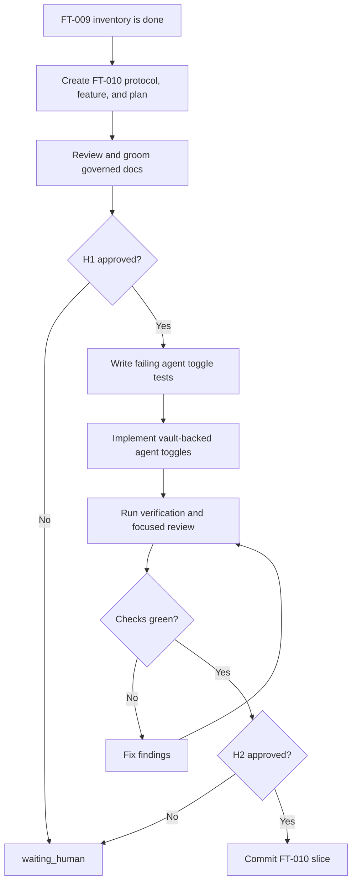

# Protocol: `FT-010 Verified Modern Surface Toggles`

## Source Interpretation

Source used:

- User instruction in this Codex thread on 2026-06-18 to continue the memory-bank workflow and implement suggested provider-surface features when possible.
- `PRD-004`, which separates read-only inventory from downstream verified write support.
- Completed `FT-009`, which added first-class read-only discovery for agents, hooks, settings, plugin configs, and plugin manifests.
- Current AgentScope mutation architecture, especially vault-backed path toggles for skills and MCP server declarations.
- Official provider docs reviewed for `FT-009`, which document agent or subagent file locations for Claude Code, Codex, and Cursor.

Repository adaptation:

- This feature follows the governed package shape `README.md`, `feature.md`, `implementation-plan.md`, and `protocol.md`.
- `PRD-004` remains the initiative owner. `FT-010` owns only the first verified writable modern surface.
- Agent files are the first writable target because provider docs define file locations and AgentScope already has a reversible vault model for file-backed capabilities.
- This feature implements an AgentScope-managed file availability toggle. It does not claim provider-native enable or disable APIs for agents.
- Hooks, settings, plugin manifests, plugin configuration declarations, permissions, and sandbox files remain read-only in this slice.

## Metadata

- Protocol version: 0.1
- Owner: Igor Arkhipov
- Work area: `/Users/igor.arkhipov/Documents/Work/Ruby/thinknetica/ai-setup`, feature `FT-010`, tool `tools/agentscope`
- Created: 2026-06-18
- Last updated: 2026-06-18
- Status: active
- Current phase: source_changes
- Current gate: H2

## Goal

Use the memory-bank lifecycle workflow to add safe, reversible AgentScope toggles for Claude Code, Codex, and Cursor agent files while preserving read-only behavior for other modern provider surfaces.

Target state:

- `memory-bank/features/FT-010/` contains protocol, canonical feature document, derived implementation plan, and README.
- Agent file inventory items become `read-write` and can be removed from provider-discovered agent directories by vaulting the file, then restored by moving it back.
- Disabled vaulted agent files remain discoverable as disabled inventory items.
- Hooks, provider settings, plugin configs, and plugin manifests continue to produce blocked read-only toggle plans.
- CLI, MCP, README, tests, and memory-bank docs agree on the new boundary.
- The feature is committed as one local feature-slice commit after local verification passes and the external CI exception is recorded; push/PR/CI execution is outside current approval.

## Scope

In scope:

- Expand the AgentScope vault entry kind contract to include `agent`.
- Add reversible file-vault toggle planning for Claude Code, Codex, and Cursor agent files from global and project roots.
- Discover vaulted disabled agent files as disabled inventory.
- Preserve read-only planning for hooks, settings, plugin configs, and plugin manifests.
- Add fixture-backed TDD coverage for disable, discover-disabled, restore, and blocked unsupported modern surfaces.
- Update README and memory-bank docs to distinguish read-write agent files from read-only modern surfaces.
- Use subagents for document review and implementation or review checkpoints where useful.

Out of scope:

- Mutating real provider configuration during implementation or verification.
- Reading or using `.env*` files.
- Editing hook command lists, provider settings, plugin manifests, permissions, sandbox files, or provider plugin install state.
- Treating provider cache internals as writable contracts.
- Pushing, opening a PR, merging, releasing, or publishing without separate approval.

## Current Facts / Baseline

Verified facts:

- `FT-009` marks agent files as first-class `kind: "agent"` and `category: "agent"` inventory.
- Current live agent file items are read-only; evidence: `tools/agentscope/src/providers/claude.ts`, `tools/agentscope/src/providers/codex.ts`, and `tools/agentscope/src/providers/cursor.ts`.
- The mutation vault currently accepts only `skill` and `configured-mcp`; evidence: `tools/agentscope/src/core/mutation-vault.ts`.
- Skill toggles already use `renamePath` plus a vault manifest for reversible file-backed disables and restores.
- The worktree has an unrelated modified `homeworks/hw-5/task-2/execution-summary.md`; it must not be staged for this feature.

Unchecked hypotheses:

- The existing vault shape can accept `agent` without changing backup, audit, or MCP toggle contracts.
- Provider agent file availability toggles can share the same filesystem safety checks as skill directory toggles.
- Duplicate declared agent names are outside this slice and remain governed by provider behavior and future drift reporting.

## Operating Constraints

- Do not read or use `.env*` files.
- Use active memory-bank documents as authoritative for intent and workflow state.
- Use fixture-backed tests and temporary roots only; never mutate real provider config during implementation or verification.
- Keep production code under `tools/agentscope/src/` and tests under `tools/agentscope/test/`.
- Do not hand-edit `dist/`; regenerate with `npm run build`.
- Keep unsupported modern surfaces blocked unless this feature explicitly changes them.
- Keep verification separate from release and external operations.

## Human Gates

### H1: Approve scoped execution

Required before:

- Editing `tools/agentscope`, `memory-bank/prd`, or `memory-bank/features/FT-010`.
- Spawning implementation or review subagents.
- Using local provider example copies as shape references.

Approval record:

- Approver: Igor Arkhipov
- Date: 2026-06-18
- Scope approved: Continue with the memory-bank workflow, use real local application configuration examples through temporary copies only, implement suggested provider-surface features when possible, and use subagents.
- Conditions: Do not modify real provider configuration directly; do not read or use `.env*`; use one commit per feature slice.

### H2: Commit point / production go-no-go

Required before:

- Creating the local FT-010 feature-slice commit.
- Pushing, opening a PR, merging, publishing, or releasing.
- Applying AgentScope mutations to real user provider config outside tests.

Required evidence before H2:

- Targeted FT-010 test output showing agent-file disable and restore coverage.
- `cd tools/agentscope && npm run build`
- `cd tools/agentscope && npm test`
- `cd tools/agentscope && npm run lint`
- `git diff --check`
- External CI exception recorded because no push or PR is approved in this local feature-slice workflow.
- Documentation and protocol evidence updated.

Approval record:

- Approver: Igor Arkhipov
- Date: 2026-06-18
- Scope approved: Local FT-010 feature-slice commit after green verification and clean focused review.
- Conditions: No push, PR, merge, release, publication, or real provider configuration mutation is approved by this record.

### H3: Destructive or irreversible action

Required before:

- Deleting user data, real provider configs, or non-test backups.
- Running package publication or release actions.
- Any irreversible filesystem or external system mutation.

Approval record:

- Approver:
- Date:
- Exact action approved:
- Rollback expectation:

## Hard Stop Conditions

Stop immediately and update `State` to `blocked` or `waiting_human` if:

- any step requires reading, printing, copying, or deriving values from `.env*`;
- any command would mutate real provider config outside fixture or temp test roots;
- implementation requires undocumented write behavior for plugins, hooks, settings, permissions, sandbox files, or provider plugin install state;
- rendered diff includes unrelated resources;
- rollback path is missing before a high-risk action;
- approval scope is unclear;
- verification cannot be run and there is no acceptable manual-only gap recorded.

## Lifecycle Flow

## State

- Status: active
- Current phase: done
- Current gate: H2
- Current actor: none
- Next action: continue to the next PRD-004 downstream slice; push, PR, merge, release, publication, external CI, or real provider configuration mutation requires separate approval.
- Open loops:
  - None for local FT-010 acceptance closure.
- Rollback mode: source-only revert for repository edits; no live provider or external state mutation is allowed.

## Execution Record

| Time | Actor | Event | Evidence |
| --- | --- | --- | --- |
| 2026-06-18 | master Codex agent | Created FT-010 protocol, feature, implementation plan, and README from PRD-004 downstream feature intent | `memory-bank/features/FT-010/` |
| 2026-06-18 | document reviewer subagent | Reviewed FT-010 docs and found CI evidence, boundary coverage, availability semantics, precondition, gate-state, and derived-plan wording issues | subagent `019edb3d-45ac-7133-bbbd-6f3f2000391b` |
| 2026-06-18 | master Codex agent | Addressed document review findings before production implementation | `protocol.md`, `feature.md`, `implementation-plan.md` |
| 2026-06-18 | master Codex agent | Wrote RED tests for read-write live agents, disabled vaulted agents, file-vault apply/restore, target-enabled no-ops, and invalid agent payload directories | `tools/agentscope/test/provider-discovery.test.ts`, `tools/agentscope/test/toggle.test.ts` |
| 2026-06-18 | master Codex agent | Implemented `agent` vault entries, provider live/vaulted agent discovery, and agent file-vault toggle planning for Claude Code, Codex, and Cursor | `tools/agentscope/src/core/mutation-vault.ts`, provider modules |
| 2026-06-18 | code reviewer subagent | Reviewed implementation and found target-enabled and vaulted-payload issues | subagent `019edb47-2efb-7152-9b91-cbe7b001dff1` |
| 2026-06-18 | master Codex agent | Fixed code-review findings, added regressions, and passed focused re-review with no findings | `npx vitest run test/provider-discovery.test.ts test/toggle.test.ts test/mcp-server.test.ts` passed, 47 tests |
| 2026-06-18 | local verifier | H2 local verification passed | `npm run build`; `npm test` passed 23 files / 188 tests; `npm run lint` exited 0 with existing Biome schema-version info; `git diff --check` passed |
| 2026-06-18 | master Codex agent | Recorded external CI exception for local feature-slice closure | No push or PR approval was granted, so external CI is outside this run |
