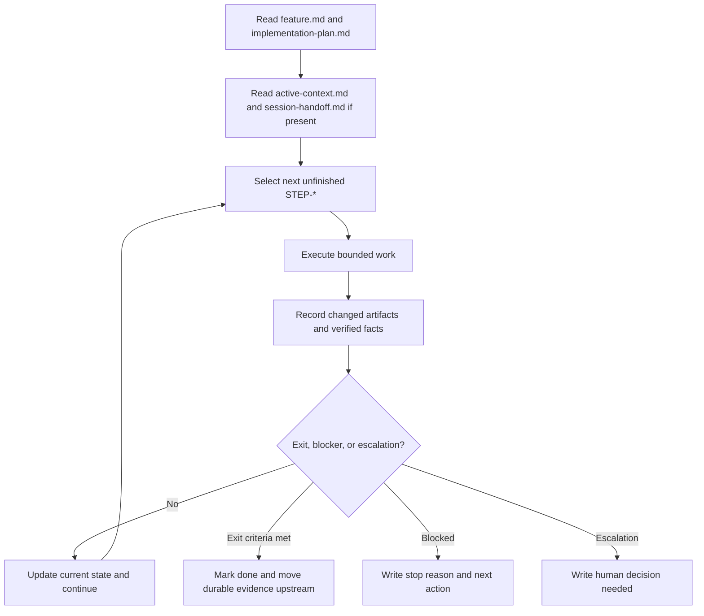

# Agent Process Operations

This document adapts reusable operating patterns from the Thinknetica AI SWE process materials into this repository's memory-bank workflow. It is a process layer, not a product or feature layer: it explains how agents should run, pause, resume, and escalate governed work.

External source materials:

- `process-state-for-long-runs`: `https://ai-swe-1.thinknetica.com/materials/verification/process-state-for-long-runs/`
- `process-specs-for-agents`: `https://ai-swe-1.thinknetica.com/materials/specification/process-specs-for-agents/`
- `human-in-the-loop`: `https://ai-swe-1.thinknetica.com/materials/orchestration/human-in-the-loop/`

## Boundary

Do not mix the process method with the state of one run.

- A process spec describes the method: the loop, transitions, entry criteria, exit criteria, escalation rules, and runner contract.
- Process state records one concrete run: current step, completed work, verified facts, stop reason, and next action.
- In this repository, `implementation-plan.md` is the governed execution plan for a feature. Do not create new legacy `plan.md` files inside feature packages.
- Temporary run-state artifacts such as `active-context.md`, `session-handoff.md`, and `review-loop.md` may support a long feature execution, but they do not own canonical scope, design, or acceptance criteria.
- If a run-state artifact reveals a durable rule, move that rule into the correct canonical owner: `feature.md`, an ADR, a use case, `workflows.md`, `feature-flow.md`, or this document.

## Process Spec Contract

Use a process spec when an agent workflow needs to be repeatable rather than improvised. A good spec contains:

1. Goal: what the process is meant to bring to completion.
2. Entry criteria: when the process is allowed to start.
3. One primary text diagram, usually Mermaid.
4. A secondary diagram only when the primary diagram cannot show an important state or handoff.
5. Step contract: what the agent does at each step and which artifacts it updates.
6. Escalation rules: when the agent must stop and involve a human.
7. Exit criteria: what signal ends the loop.
8. Runner prompt or script: the executable instruction layer that keeps the agent inside the loop.

Diagram selection:

| Diagram | Use when | Best for |
| --- | --- | --- |
| `flowchart` | The process is mostly ordered steps and branches. | Control flow. |
| `stateDiagram-v2` | The process can pause, resume, block, or wait for a human. | Durable run states and allowed transitions. |
| `sequenceDiagram` | Ownership transfer matters. | Agent, human, reviewer, or stage handoffs. |

For memory-bank feature work, default to a `flowchart`. Add `stateDiagram-v2` for long runs with handoff/resume. Add `sequenceDiagram` for HITL or escalation paths where decision ownership matters.

## Observable Runner Contract

A runner prompt, slash command, or shell wrapper is valid only when its behavior is observable after each iteration.

The runner reads:

- the process spec;
- the current process state artifact, when one exists;
- the governed feature package or other working artifacts;
- related specs, acceptance scenarios, and verification criteria.

After each iteration the runner updates:

- at least one process-state artifact, or the governed execution plan if no separate state file is needed;
- the current step status;
- verified facts;
- the next step or explicit stop reason.

The runner returns exactly one of these statuses:

- `continue`
- `done`
- `blocked`
- `escalation`

The runner leaves a trace that answers:

- which step was worked;
- what changed;
- what was verified;
- which artifacts were updated;
- which status the process moved to.

If this trace is missing, the loop is not verifiable even if the prompt or diagram looks complete.

## Long-Run State Artifacts

Use external state for any task that is likely to span more than one session, include review or verification loops, require human checkpoints, or risk context loss.

This repository's adapted state pack is:

| Artifact | Role | When to create | When to update |
| --- | --- | --- | --- |
| `implementation-plan.md` | Governed execution plan with `STEP-*`, `CHK-*`, `EVID-*`, `AG-*`, and stop conditions. | Only after sibling `feature.md` is design-ready. | When sequencing, checks, evidence, approvals, or execution status changes. |
| `active-context.md` | Current run focus, working assumptions, verified facts, open risks, and next check. | After a real implementation plan exists, if execution will not finish in one short run. | After changing the active step, discovering a material fact, replanning, or running a check that changes direction. |
| `session-handoff.md` | Safe resume point: what happened, what was verified, why the run stopped, and the next action. | At a real pause, blocker, context limit, human wait, or transfer to another run. | Rewrite at each handoff so only one current resume point exists. |
| `review-loop.md` or verification notes | Review findings, fix attempts, rechecks, and quality signals. | When the task uses a review, replan, or verification loop that may span iterations. | After each finding, fix, and recheck cycle. |

When the feature is done, archive or remove temporary run-state artifacts after durable conclusions are moved into the canonical owner. Do not leave stale handoff files that point to work that no longer exists.

## Long-Run Execution Loop



The critical sequence is: execute bounded work, record evidence, update status, then decide whether to continue. Skipping the evidence/status step turns a long run into memory-based improvisation.

## HITL Autonomy Rules

Choose human participation based on action risk, reversibility, and sensitivity.

| Action risk | Reversibility | Default HITL level |
| --- | --- | --- |
| Low | Easy to revert | Human-out-of-the-loop: the agent may proceed and summarize. |
| Medium | Revertible with review | Human-on-the-loop: the agent proceeds, but the human reviews summaries, diffs, or quality gates. |
| High | Irreversible, externally effective, or sensitive | Human-in-the-loop: the agent proposes, the human approves, then the action happens. |

Mandatory human-in-the-loop gates include:

- destructive file or data operations;
- publishing, pushing, merging, releasing, or changing external systems;
- changes that affect secrets, credentials, private data, billing, production infrastructure, or irreversible state;
- scope, architecture, or acceptance changes that conflict with active upstream documents;
- unclear high-impact review findings where the agent cannot safely choose the product or engineering trade-off.

Autonomy can increase only after repeated clean runs. A practical progression is:

1. Human approves each review finding before fixes.
2. Agent fixes low and medium findings; human reviews high or critical findings.
3. Human reviews summary, diff, and quality gates rather than each small edit.
4. Human participates only on escalation, failed gates, risky operations, or disputed decisions.

HITL does not disappear; it moves to a higher control layer.

## Reusable Prompt: Process Runner

```text
Work according to the process spec `<process-spec-file>`.

Rules:
1. Read Goal, Entry Criteria, Flow, Step Contract, Escalation Rules, and Exit Criteria.
2. Read the current process-state artifacts and the relevant governed documents.
3. Find the current step. Do not skip transitions or invent new scope.
4. Execute only the bounded work needed for the current step.
5. After each step, update the artifacts named in the Step Contract.
6. Record what changed, what was verified, and what remains.
7. If Exit Criteria are met, stop with status `done`.
8. If an Escalation Rule triggers, stop with status `escalation` and name the human decision needed.
9. If blocked, stop with status `blocked` and write the blocker plus the exact resume action.
10. Otherwise stop or continue with status `continue`, depending on the caller's instruction.

End with:
- step worked;
- artifacts changed;
- checks performed;
- process status: `continue`, `done`, `blocked`, or `escalation`;
- next step or stop reason.
```

## Reusable Prompt: Long-Run Feature Executor

```text
Work as the executor of a long-running memory-bank feature workflow.

Current artifacts:
- `feature.md`
- `implementation-plan.md`
- `active-context.md`, if present
- `session-handoff.md`, if present
- review or verification-loop notes, if present

Rules:
1. Read `feature.md` for canonical scope, non-scope, design, acceptance scenarios, checks, and evidence.
2. Read `implementation-plan.md` and find the next unfinished `STEP-*`.
3. If `session-handoff.md` exists, reconcile it with the plan before continuing.
4. Execute only the bounded fragment needed to advance the current step.
5. Do not redefine scope, architecture, or acceptance in the plan. Raise upstream changes into `feature.md` or an ADR first.
6. After work, record changed artifacts, verified facts, and remaining risks.
7. Update `implementation-plan.md` status/check evidence as appropriate.
8. Update `active-context.md` when execution will continue later.
9. Write or rewrite `session-handoff.md` if this run stops before completion.
10. If exit criteria are met, stop instead of continuing to polish beyond the plan.

End with:
- current `STEP-*`;
- what changed;
- what was verified;
- which checkboxes or statuses changed;
- next step, blocker, or escalation request.
```

## Reusable Prompt: Handoff Writer

```text
Write a session handoff for the current memory-bank run.

Use English. Be concrete and verifiable. Do not summarize the whole chat.

Include:
1. Current state: where the run stopped and which `STEP-*` was active.
2. Changed artifacts: files or documents changed in this run.
3. Verified facts: checks performed and their results.
4. Open risks: facts not yet checked, assumptions, or known weak spots.
5. Stop reason: completion, blocker, human wait, context limit, or transfer.
6. Next action: the exact first action the next session should take.
7. Escalation needed: yes/no, with the human decision required if yes.
```

## Reusable Prompt: Process Spec Author

```text
Create or revise a process spec for a memory-bank workflow.

Use English. Keep method and run state separate.

The process spec must include:
- Goal;
- Entry Criteria;
- one primary Mermaid diagram;
- Step Contract with artifacts updated by each step;
- Escalation Rules;
- Exit Criteria;
- Observable Runner Contract;
- prompt or command that runs the loop;
- safe handoff/resume behavior if the process can span sessions.

Use `flowchart` for step flow, `stateDiagram-v2` for pause/resume states, and `sequenceDiagram` only when ownership transfer between agent, human, reviewer, or stage matters.

Reject specs that are only a diagram, only prose, lack updated artifacts, lack escalation rules, or cannot be stopped and resumed safely.
```

## Review Checklist

Before treating a long-run workflow as governed, verify:

- the method is separate from one run's state;
- entry criteria and exit criteria are explicit;
- every loop iteration leaves a status and evidence trace;
- the runner has a bounded current step;
- HITL gates match action risk and reversibility;
- stale handoff files are not left behind after completion;
- durable lessons have moved from temporary state into canonical documents.
