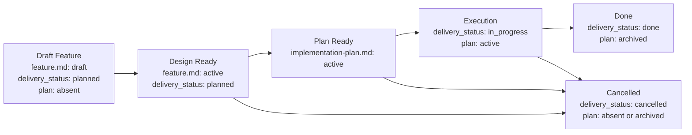

# Feature Flow

This document defines the order in which feature artifacts appear. An agent should move a feature package through stages and should not create downstream artifacts before their upstream owner is mature enough.

## Package Rules

1. All documents for one feature live in `memory-bank/features/FT-XXX/`.
2. **Feature = vertical slice.** One feature is one user-visible unit of value that cuts through every affected layer of the system: UI, API, storage, and infra. Horizontal slicing such as "all endpoints" or "all UI" is acceptable only for pure infra or refactoring tasks and must be justified explicitly through `NS-*`.
3. `feature.md` is the canonical owner of intent, delivery-scoped target outcome or KPI, design, and verification for the delivery unit.
4. `README.md` is created together with `feature.md` and remains the routing layer through the whole lifecycle.
5. `implementation-plan.md` is a derived execution document. It must not exist until the sibling `feature.md` is design-ready.
   While a feature is in execution, the plan is the active execution document. After the feature reaches `done` or `cancelled`, the plan is archived and retained as the historical execution record rather than as an active owner.
6. For canonical `feature.md`, feature-level `README.md`, and `implementation-plan.md`, use the wrapper templates in `memory-bank/flows/templates/feature/`. The template file itself has `doc_function: template`; the frontmatter and body of the instantiated document live inside the embedded template contract.
7. The meaning of stable identifiers such as `REQ-*`, `NS-*`, `CHK-*`, and `STEP-*` is defined in the "Stable Identifiers" section below.
8. Acceptance scenarios (`SC-*`) cover the vertical slice end to end: from the triggering input to the observable result across all affected layers. Testing a single layer in isolation is allowed as an implementation detail of the plan, but it does not replace end-to-end acceptance.
9. **Task tracker linkage.** When creating a feature package, the agent must add links from the source task or ticket to `feature.md` and, once it exists, to `implementation-plan.md`. This preserves navigation from the task tracker to the specification without manual searching.
10. If the feature is part of a larger initiative, `feature.md` may depend on a PRD in `memory-bank/prd/`, but the PRD does not replace the feature package itself.
11. If the feature creates a new stable project scenario or materially changes an existing one, the corresponding `UC-*` in `memory-bank/use-cases/` must be created or updated before closure.

## Choosing The `feature.md` Template

`short.md` is allowed only if all of the following are true:

1. the feature can be described with `REQ-*`, `NS-*`, at most one `CON-*`, one `EC-*`, one `CHK-*`, and one `EVID-*`;
2. `feature.md` does not need `ASM-*`, `DEC-*`, `CTR-*`, `FM-*`, rollout or backout rules, or ADR-dependent design rules;
3. the change does not introduce or modify an API, event, schema, file format, CLI, or env contract;
4. verification fits into one primary check without quality slices and without multiple acceptance scenarios.

If any condition fails, the agent must choose or upgrade to `large.md` before continuing. Upgrade is also mandatory if a feature starts as `short.md` but later requires `ASM-*`, `DEC-*`, `CTR-*`, `FM-*`, more than one acceptance scenario, or more than one `CHK-*` / `EVID-*`.

## Lifecycle

## Transition Gates

Each gate is a set of verifiable predicates. A transition is allowed if and only if all predicates are true.

### Bootstrap Feature Package

- [ ] `README.md` is created from the `templates/feature/README.md` template
- [ ] `feature.md` is created from the `short.md` or `large.md` template
- [ ] `implementation-plan.md` does not exist

### Draft → Design Ready

- [ ] `feature.md` → `status: active`
- [ ] the `What` section contains at least one `REQ-*` and at least one `NS-*`
- [ ] the `Verify` section contains at least one `SC-*`
- [ ] every `REQ-*` traces to at least one `SC-*` through the traceability matrix
- [ ] the `Verify` section contains at least one `CHK-*` and at least one `EVID-*`
- [ ] if the deliverable cannot be accepted without negative or edge coverage, there is at least one `NEG-*`

### Design Ready → Plan Ready

- [ ] the agent has completed grounding: it inspected the current state of the system, including relevant paths, existing patterns, and dependencies, and recorded the result in the discovery context section of `implementation-plan.md`
- [ ] `implementation-plan.md` is created from `templates/feature/implementation-plan.md`
- [ ] `implementation-plan.md` → `status: active`
- [ ] `implementation-plan.md` contains at least one `PRE-*`, one `STEP-*`, one `CHK-*`, and one `EVID-*`
- [ ] the discovery context in `implementation-plan.md` contains relevant paths, local reference patterns, unresolved questions (`OQ-*`), test surfaces, and execution environment

### Plan Ready → Execution

- [ ] `feature.md` → `delivery_status: in_progress`
- [ ] `implementation-plan.md` → `status: active`
- [ ] `implementation-plan.md` records the test strategy: automated coverage surfaces and required local or CI suites
- [ ] every manual-only gap has a reason, a manual procedure, and an `AG-*` with an approval reference

### Execution → Done

- [ ] all `CHK-*` entries from `feature.md` have a pass or fail result in evidence
- [ ] all `EVID-*` entries from `feature.md` are populated with concrete carriers such as a file path, CI run, or screenshot
- [ ] automated tests for the change surface were added or updated
- [ ] required test suites are green locally and in CI
- [ ] every manual-only gap is explicitly approved by a human, with the approval reference recorded in `AG-*`
- [ ] simplify review is complete: the code is minimally complex or any complexity is justified through `CON-*`, `FM-*`, or `DEC-*`
- [ ] if the feature adds a new stable flow or materially changes an existing project-level scenario, the corresponding `UC-*` is created or updated and registered in `memory-bank/use-cases/README.md`
- [ ] `feature.md` → `delivery_status: done`
- [ ] `implementation-plan.md` → `status: archived`

### → Cancelled (from any stage after Draft)

- [ ] `feature.md` → `delivery_status: cancelled`
- [ ] `implementation-plan.md` is absent or has `status: archived`

## Boundary Rules

1. `feature.md` must contain the sections `What`, `How`, and `Verify`.
2. `Verify` in `feature.md` defines the canonical test case inventory for the delivery unit: positive cases via `SC-*`, feature-specific negative coverage via `NEG-*` when needed, executable checks via `CHK-*`, and evidence via `EVID-*`.
3. If the feature depends on an ADR, `feature.md` links to the corresponding file in `memory-bank/adr/` and respects its `decision_status`; `proposed` does not count as finalized design.
4. If the feature depends on a canonical use case, `feature.md` links to the corresponding file in `memory-bank/use-cases/`. The use case remains the owner of trigger, preconditions, main flow, and postconditions at project level, while `feature.md` captures only the slice-specific implementation.
5. `implementation-plan.md` remains a derived execution document: it references canonical IDs from `feature.md` or an ADR, records execution-oriented test strategy, required local or CI suites, and approval references for manual-only gaps, and must not redefine scope, architecture, blockers, acceptance criteria, or the evidence contract. Once archived, it remains the retained execution record for the completed feature, not an active source of truth.
6. If scope, architecture, acceptance criteria, or the evidence contract change, update `feature.md` or the ADR first, then update the downstream plan.
7. If a numeric target threshold belongs to only one delivery unit, its canonical owner is the corresponding `feature.md`. Promote such a KPI into a project-level document only after it becomes a shared upstream fact for multiple features.
8. A good `implementation-plan.md` starts with discovery context: relevant paths, local reference patterns, unresolved questions, test surfaces, and execution environment should be recorded before sequencing changes.
9. For risky, irreversible, or externally effective actions, `implementation-plan.md` must describe explicit human approval gates rather than hiding them inside prose.

## Test Ownership Summary

Canonical testing policy lives in [../engineering/testing-policy.md](../engineering/testing-policy.md). The summary below is sufficient to create a feature package without opening the full policy document.

1. **Canonical test cases** for a delivery unit are defined in `feature.md` through `SC-*`, feature-specific `NEG-*`, `CHK-*`, and `EVID-*`. `implementation-plan.md` owns only the execution strategy: which suites to add and which gaps remain temporarily manual-only and why.
2. **Sufficient coverage** means the main changed behavior is covered, along with new or changed contracts, critical failure modes from `FM-*`, and feature-specific negative or edge scenarios when they affect the verdict. Line coverage percentage alone is not enough.
3. **Manual-only verification** is allowed only as an explicit exception, for example when live infra, hardware, or a nondeterministic environment is involved. Each gap must include the reason, a manual procedure or `EVID-*`, owner follow-up, and an approval reference via `AG-*`.
4. **By Design Ready**, `feature.md` already records the test case inventory: at least one `SC-*` and traceability to `REQ-*`. **By Done**, automated tests have been added and required suites are green both locally and in CI.
5. **Simplify review** is a separate pass after functional testing and before closure. Its goal is to ensure the code is minimally complex. Three similar lines are better than a premature abstraction. Complexity is justified only when tied to `CON-*`, `FM-*`, or `DEC-*`.
6. **Verification context separation** means functional verification, simplify review, and acceptance testing are three logically separate passes. The agent should form conclusions after each pass before starting the next one. For short features these may happen in one session, but simplify review must not be skipped.

## Stable Identifiers

### Feature IDs

| Prefix | Meaning | Used in |
| --- | --- | --- |
| `MET-*` | outcome metrics | `feature.md` |
| `REQ-*` | scope and required capability | `feature.md` |
| `NS-*` | non-scope | `feature.md` |
| `ASM-*` | assumptions and working premises | `feature.md` |
| `CON-*` | constraints | `feature.md` |
| `DEC-*` | blocking decisions | `feature.md` |
| `NT-*` | do-not-touch / explicit change boundaries | `feature.md` |
| `INV-*` | invariants | `feature.md` |
| `CTR-*` | contracts | `feature.md` |
| `FM-*` | failure modes | `feature.md` |
| `RB-*` | rollout / backout stages | `feature.md` |
| `EC-*` | exit criteria | `feature.md` |
| `SC-*` | acceptance scenarios | `feature.md` |
| `NEG-*` | negative / edge test cases | `feature.md` |
| `CHK-*` | checks | `feature.md`, `implementation-plan.md` |
| `EVID-*` | evidence artifacts | `feature.md`, `implementation-plan.md` |
| `RJ-*` | rejection rules | `feature.md`, `implementation-plan.md` |

### Plan IDs

| Prefix | Meaning | Used in |
| --- | --- | --- |
| `PRE-*` | preconditions | `implementation-plan.md` |
| `OQ-*` | unresolved questions / ambiguities | `implementation-plan.md` |
| `WS-*` | workstreams | `implementation-plan.md` |
| `AG-*` | approval gates for risky actions | `implementation-plan.md` |
| `STEP-*` | atomic steps | `implementation-plan.md` |
| `PAR-*` | parallelizable blocks | `implementation-plan.md` |
| `CP-*` | checkpoints | `implementation-plan.md` |
| `ER-*` | execution risks | `implementation-plan.md` |
| `STOP-*` | stop conditions / fallback | `implementation-plan.md` |

### Required Minimum

1. Any canonical `feature.md` uses at least `REQ-*`, `NS-*`, `SC-*`, `CHK-*`, and `EVID-*`.
2. Any `feature.md` with `status: active` defines at least one explicit test case via `SC-*`.
3. A short feature may additionally use only the minimal set described in `memory-bank/flows/templates/feature/short.md`.
4. A large feature may use the extended feature ID set as needed.
5. Any `implementation-plan.md` uses at least `PRE-*`, `STEP-*`, `CHK-*`, and `EVID-*`; when ambiguity or human approval gates are present, `OQ-*` and `AG-*` are used.

### Traceability Contract

1. Scope in `feature.md` is recorded through `REQ-*`; non-scope through `NS-*`.
2. `Verify` in `feature.md` links `REQ-*` to test cases through Acceptance Scenarios, feature-specific `NEG-*`, the Traceability matrix, the Test matrix, and the Evidence contract.
3. `implementation-plan.md` refers to canonical IDs from `feature.md` in the `Implements`, `Verifies`, and `Evidence IDs` columns.
4. If sequencing is blocked by an unknown, the plan records it as `OQ-*` instead of hiding it in prose.
5. If execution requires human confirmation for risky actions, the plan records that through `AG-*`.
6. If an ID starts being used as a stable entity, its meaning must remain compatible with this document.
